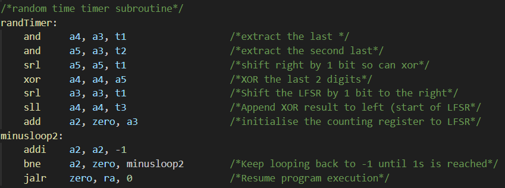
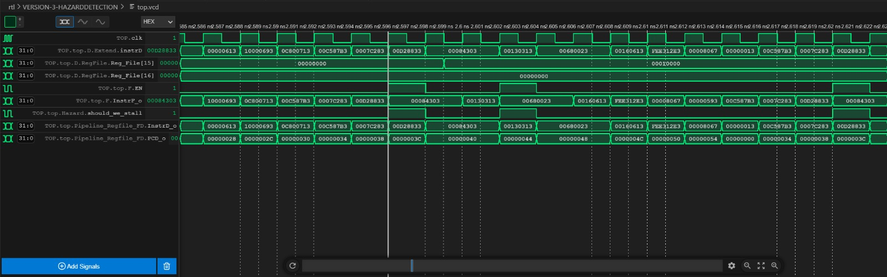

# Personal statement | Benny Zong Liu 

## Contribution to the stages:

### Version 1: Single cycle

Being the repo master for Lab 4, I decided to take on the broader role of overseeing and delegating tasks for the creation of the single cycle CPU. I first created the `F1.s` file using assembly, which allowed the team to work out which specific instructions were needed to create a functioning CPU that supports `F1.s`.

When creating `F1.s`, I realised that I could not get trigger to be activated manually without exposing some part of the CPU directly. For which, I decided to connect register `t0` directly to the the top layer outputs so that we can directly access and modify the CPU state to react to the trigger. This is hooked up to the rotary encoder of the vBuddy using `vbdFlag()`.  

Throughout the design and debugging process, I was involved with testing and refining code made by my teammates and giving them feedback to make improvements to the CPU design. Various bugs like unimplemented `x0` register behaviour and mismatched bit lengths were fixed by me. In return, my teammates also gave me feedback on testing with the `F1.s` program that allowed me to make relevant bugfixes. 

In addition, I also implemented additional instructions (`AND`, `XOR`, `SLL` and `SLR`) to accomodate a LFSR that I have coded into `F1.s`. 

#### Challenges and mistakes

The merging process of the different branches was particularly difficult, as I was making changes to the main branch while the other group members were continuing their work on different branches. Some of these changes were overlapping and this led to divergence and clashes when trying to merge. This was further complicated by group members creating new file structures that made it very hard to merge.

This was eventually solved, but not without the occasional erronous commits and rollbacks. This taught me the importance of having a good project structure since the start to allow for effective compartmentalisation of work. 

Making the `F1.s` program before the CPU was tested and verified to be working meant that we had to debug both the CPU and the `F1.s` file at the same time, making it hard to pin down the exact faults and fix them efficiently. I think if I were to do it again, I would write test files that systematically tests each instruction before jumping straight into the F1 program. 

Lastly, I realised that the main reason why my groupmates and I were having trouble compiling and running the program was due to the End of Line Sequence being different. Some group mates were using Anaconda and thus had CRLF for line ending, while other needed LF for their linux environments. Fixing this bug greatly sped up our development process since everyone could now debug faster without major overhaul to their workspace. 

### Version 2: Pipelining

I was responsible for creating the F-stage of the pipelining CPU. The planning and work division was done by **Yueming Wang** (@rrroooyyywang). Making the stage was a rather straightforward process since the underlying code was already done, and I just needed to correctly name the input and output of the new module according to the naming convention established. I also modified my `F1.s` to contain appropriate `nop` intructions to prevent data hazards when testing the program on the CPU. 

Working with **Deniz** (@DenizzG), we linked together the relevant pipeline registers with my F-stage. There were some inconsistencies with the naming which were fixed with our regular meetup sessions that consolidated all changes. Me and **Adrian** (@adrianyk) also created the new `top.sv` top level file to tie together all the new modules (F, D, E, M and W). This was a tedious process where all signals bit lengths and module i/o needed to be identified and debugged. 

Lastly, I worked together with **Adrian** to implement the additional logic needed to implement `JALR` and `JAL`. Since there is now an alternate source of `PC` from the `ALUResult` line. We solved this by simply applying a MUX to the signals and choosing the appropriate input to `PC` accordingly. By doing this, we eliminate the need for a complex logic gate design that would otherwise do the same thing.

#### Challenges and mistakes

The challenge for creating the pipeline stage for me was testing the whole thing. This is due to the vast increase in the number of inter-module connetions that arose from splitting the CPU into various stages and pipeline registers. This required stringent checks on all input and output names, bit lengths and clocking sensitivity. Consequently, debugging in the `.vcd` file also became harder and pipelining errors were much more difficult to dig out and correct.

### Version 3: Hazard Detection

For Hazard detection, I helped to create the Flush and Stalling feature for the hazard unit along with **Adrian** and **Deniz**. This was done by creating a new module `Hazard.sv` that took in the read/write register addresses and stalled the appropriate stages or cleared the pipeline registers when a flush is needed to clear incorrectly fetched instructions.

#### Challenges and mistakes

This was one of the stages with the least amount of code writing and most amount of debugging. The nature of the new module meant that testing was cruicial, and I managed to catch a conditional error that saw undesirable stalling behaviour that stalled instructions 1 cycle too late. 

This bugfix was particularly difficult since this was a runtime error that disguised itself as a timing issue. This resulted in many unsuccessful attempts to fix it where I changed the rising edge sensitivity of pipeline registers. 

However, this error was caught after realising that an instruction was always lost when the delayed stall took place. This led me to discover that the logic for the pipeline register between the Fetch and Decode stages led to the signal being forwarded despite a stall signal being asserted. 

## Special design decisions I made

### LFSR in `F1.s`

Fig 1: LFSR in F1.s

In order to achieve a pseudo-random number generator for counting down, I created a very simple 4-bit LFSR, where only the 2 least significant bits are "XORed" to be appended to the start after shifting. 

### `t0` as Trigger

I made t0 the register directly controlled by `vbdFlag()`, acting as a trigger for `F1.s`. This choice was made for easy testing of the `F1.s` file since we can start the lights at will. Although this comes with the disadvantage of being unable to use that particular register for anything else if `vbdFlag()` is used. 

## Reflection

The project had taught me about the various design choices a CPU designer would have to go through, and the possible consequences if that standard was not enforced diligently. These problems would materialise in the form of difficult to read code and incomplete documentation of the different functions of the code. 

I also learnt an important skill of debugging by looking at the waveform, where hard to catch bugs can be systematically broken down and pinpointed to a specific module by tracing the error down to the last wire at which it occured at.

Fig 2: Debugging screenshot of delayed stall

Looking at the non-technical aspect of the project, I had learn many things about working together as a group with different things that we are good at. My group had a slow start to the project initially, and I did not think that we could achieve so much over the short span of a few weeks. 

However, I was surprised by how much more we could achieve as a group despite our initially differing schedules and delayed communication. Everyone was able to chip in and contribute with a willingness to put in the necessary effort to achieve our collective goal of making a working CPU.

I felt that there were things that I could've done differrently, like create better testing that would cut down debugging time significantly and create a more comprehensive testing environment to better catch edge cases. 

I also wished that I had more finely spread out my commits so that it would be easier to track my changes rather than grouping together all the commits I have done for the entire sitting.

### Appendix

*Note: some co-authoring commits has my wrong email and are thus do not appear in the thumbnail*

#### Github commit list
| Commit ID | Title |
| --- | --- |
| [81d6cef8ef1ca87939dee1f62ae211429395a692](https://github.com/Bennybenassius/RV32I-Team15/commit/81d6cef8ef1ca87939dee1f62ae211429395a692) | Created F1.s |
| [26ba64df51b2bac84e8b8a82ee658b2ae104f7d4](https://github.com/Bennybenassius/RV32I-Team15/commit/26ba64df51b2bac84e8b8a82ee658b2ae104f7d4) | Updated F1.s |
| [1993d6b1abb1ff0519c3066db4572a8598f90ab7](https://github.com/Bennybenassius/RV32I-Team15/commit/1993d6b1abb1ff0519c3066db4572a8598f90ab7) | Updated F1.s |
| [36ca37b6ec411781250c424d5eac940c7b69c07d](https://github.com/Bennybenassius/RV32I-Team15/commit/36ca37b6ec411781250c424d5eac940c7b69c07d) | Added AND, XOR and SLL |
| [bbe2a8085892999d98cf2fe8fb559f8d2729415b](https://github.com/Bennybenassius/RV32I-Team15/commit/bbe2a8085892999d98cf2fe8fb559f8d2729415b) | Fixed errors, typos and debugging |
| [f0f0992137ad8596d186f7a658ab426641fe5774](https://github.com/Bennybenassius/RV32I-Team15/commit/f0f0992137ad8596d186f7a658ab426641fe5774) | Fixed branch and main compatibility |
| [4362ac543d50e4f9d32a926f60fcc302bc6e7909](https://github.com/Bennybenassius/RV32I-Team15/commit/4362ac543d50e4f9d32a926f60fcc302bc6e7909) | Removed redundant F1.s |
| [2c56f8acad64152603ebb4497dd9882c6ff66a36](https://github.com/Bennybenassius/RV32I-Team15/commit/2c56f8acad64152603ebb4497dd9882c6ff66a36) | Implemented new Instruction and bugfixes |
| [917c912bc76730595913c7687cc06155839b48ca](https://github.com/Bennybenassius/RV32I-Team15/commit/917c912bc76730595913c7687cc06155839b48ca) | Bugfixes |
| [dd6a23407aaa482821837e1b11120ab0159d350c](https://github.com/Bennybenassius/RV32I-Team15/commit/dd6a23407aaa482821837e1b11120ab0159d350c) | Added trigger |
| [ba8fa2c6b2edef90ee970cc5bb88a9471f792773](https://github.com/Bennybenassius/RV32I-Team15/commit/ba8fa2c6b2edef90ee970cc5bb88a9471f792773) | Fixed syntax error and bugfixes |
| [ee257eec0450f709ce0d36578ee73b7d6129ccea](https://github.com/Bennybenassius/RV32I-Team15/commit/ee257eec0450f709ce0d36578ee73b7d6129ccea) | Bugfixes |
| [653d6882d9afe9cdc2be0016d5435da4f9083150](https://github.com/Bennybenassius/RV32I-Team15/commit/653d6882d9afe9cdc2be0016d5435da4f9083150) | Created F1_Pipeline.s |
| [db6347c54ec27021e5af818d1bdb95635ba0d5dc](https://github.com/Bennybenassius/RV32I-Team15/commit/db6347c54ec27021e5af818d1bdb95635ba0d5dc) | Added F.sv |
| [9f3de7aba4b43e6c1146895e57cda6f57365e1b2](https://github.com/Bennybenassius/RV32I-Team15/commit/9f3de7aba4b43e6c1146895e57cda6f57365e1b2) | redefined ZeroE: LSB encodes =, MSB encodes >/< |
| [eeecb78410f4333d8dbf75e9f6fafd84c1e3ecd8](https://github.com/Bennybenassius/RV32I-Team15/commit/eeecb78410f4333d8dbf75e9f6fafd84c1e3ecd8) | made JumpD a 2 bit signal to distinguish no jump, JALR and JAL|
| [fa4e1f676906864ff4ac5e4c0bbb76d2ce7972c3](https://github.com/Bennybenassius/RV32I-Team15/commit/fa4e1f676906864ff4ac5e4c0bbb76d2ce7972c3) | Changed implementation of PCSrcE to use case statment|
| [c74a3e6dabc3d9c1d637ca66df8ce1fa3afdbd3a](https://github.com/Bennybenassius/RV32I-Team15/commit/c74a3e6dabc3d9c1d637ca66df8ce1fa3afdbd3a) | Changed top.sv to match pipelining |
| [8ca9636892b0df3b45ff980385d61ca19d8ea707](https://github.com/Bennybenassius/RV32I-Team15/commit/8ca9636892b0df3b45ff980385d61ca19d8ea707) | added nops after all jump instructions |
| [daef61d99678b4ef73518e54b6ecec1907f84cf7](https://github.com/Bennybenassius/RV32I-Team15/commit/daef61d99678b4ef73518e54b6ecec1907f84cf7) | modified branch instr case statements to distinguish between 4 branch instr |
| [501b6628be92eefd15bbda953a5ff1711e54005b](https://github.com/Bennybenassius/RV32I-Team15/commit/501b6628be92eefd15bbda953a5ff1711e54005b) | removed pass-by signals, added case statements for PCSrcE (branch/jump)|
| [dadb707da5bdd56c1499884ed98f1c25952eda25](https://github.com/Bennybenassius/RV32I-Team15/commit/dadb707da5bdd56c1499884ed98f1c25952eda25) | housekeeping (please check comment) |
| [c3bbf9c179c77d65377717da43d61cb30a260af2](https://github.com/Bennybenassius/RV32I-Team15/commit/c3bbf9c179c77d65377717da43d61cb30a260af2) | Bugfixes of wrong bit length on i/o |
| [928570ceb0ca642799eb9c4906818b0f6b4faa89](https://github.com/Bennybenassius/RV32I-Team15/commit/928570ceb0ca642799eb9c4906818b0f6b4faa89) | Fixed bug of SrcBE not assigning |
| [532f1ec59343c826b306ff262924e9b07ba0396e](https://github.com/Bennybenassius/RV32I-Team15/commit/532f1ec59343c826b306ff262924e9b07ba0396e) | Fixed pipelining timing issue and F1.s |
| [284d20f710b63daa13e27ddb1f45fa3b80a03421](https://github.com/Bennybenassius/RV32I-Team15/commit/284d20f710b63daa13e27ddb1f45fa3b80a03421) | Fixed typos |
| [7fb46f7dae1d08b22ad08b5c6ffa6bdd188a9711](https://github.com/Bennybenassius/RV32I-Team15/commit/7fb46f7dae1d08b22ad08b5c6ffa6bdd188a9711) | Added stall and flush to hazard unit |
| [d6f2a3d58655650e58c6d6e43a38b14a8610799d](https://github.com/Bennybenassius/RV32I-Team15/commit/d6f2a3d58655650e58c6d6e43a38b14a8610799d) | added EN and CLR to pipeline reg for FLUSH and STALL, text formatting |
| [91b1d303d3b922a6c2bd78d93601d8c8c3a76d83](https://github.com/Bennybenassius/RV32I-Team15/commit/91b1d303d3b922a6c2bd78d93601d8c8c3a76d83) | Fixed pipelining Stall malfunction |

