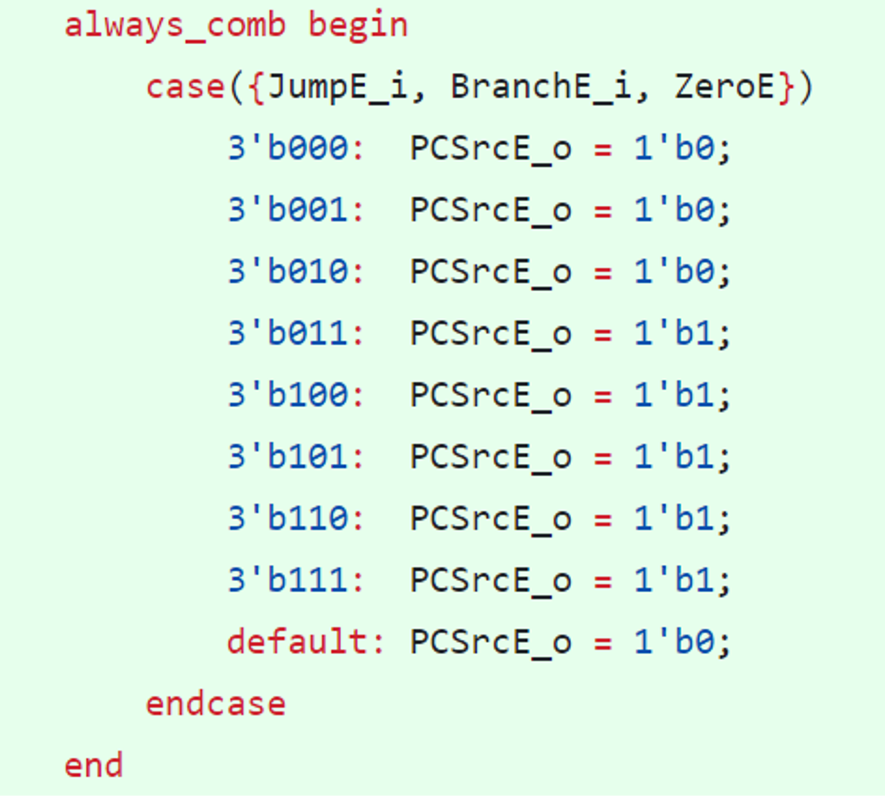

RISC-V RV32I Processor Coursework 

Personal statement of Contributions 

Warning: Long sections of code are pasted as a PNG to make the file easier to read.

### My Contributions -------------------***Deniz Goy*** 
1.  *Program Counter*
1.  *ALU*
1.  *Control Unit + Sign Extension Unit*
1.  *Pipelining*
1.  *Hazard detection* 
### What I learnt
1.  *Using Git and GitHub*
1.  *Testing the ALU*
1.  *Efficient Programming*
1.  *What I would do differently* 
## My Contributions
### Program Counter
Relevant commits:
1. ([Finalised program Counter](https://github.com/Bennybenassius/Team15/commit/fc7eaafcdb8e9d6bac1d57233fa4fb353c10b331))

I made the Program Counter Module for Lab 4, and later made changes to use in the project. The initial design for the program counter included a simple counter that would increment by 1 unless reset was high, at which point the program counter would reset to 0.

```
assign  branch_PC = ImmOp + PC_out;
assign  next_PC = PCsrc ? branch_PC : PC_out + 32'b100;
always_ff @ (posedge clk, posedge rst)begin
    if (rst)    PC_out <= 32'b0;
    PC_out <= next_PC;
end
```
Figure 1: Lab4 PC

The first working implementation shown in Figure 1. It has 2 inputs, rst and PCsrc. next\_PC is instantiated to either the value of branch\_PC if there is a branch instruction or PC+4.


Figure 2: Byte addressing.

The reason for PC being incremented by 4 and not 1 (Figure 2) is that we implement byte addressing instead of word addressing. Byte addressing allows us to access each byte individually, speeding up processing speed. However, it means that the memory wasted in PC is 3/4ths of PC, however the advantages outweigh the disadvantages.  

```always\_comb begin // 4 input MUX
`    `case (rst)
`        `1'b1:   PCNext = 0; 
`        `1'b0:   begin
`            `case (PCSrc)
`                `2'b00 :  PCNext = PCPlus4;
`                `2'b01 :  PCNext = PCTarget;
`                `2'b10 :  PCNext = PCjalr;
`                `default: PCNext = PCPlus4;
`            `endcase
`        `end
`    `endcase
end
always\_ff @ (posedge clk)begin
`    `PC <= PCNext;
end;
```
Figure 3: PC implementation for Project

For the project, we used a case statement as no we have 3 different cases for PCsrc. 2’b00 normally increments PC by 4, but 2’b01 is reserved for a PC jal and branch instruction while 2’b10 is reserved specifically for jalr instructions. So because we needed a more bits to implement this logic than seen on the original schematic, we decided to specifically implement this change as a case statement. This made the code more efficient and easier to interpret 

### ALU
Relevant Commits:
1. ([Coded all ALU instructions](https://github.com/Bennybenassius/Team15/commit/c58610ed2528410bc3fce4b7fc696907810fbb48))

The ALU is responsible for carrying out the R-type 3 register instructions for the CPU. Although we only use half of the instructions in the final F1 program, I coded all of them in the final design of our ALU for redundancy, causing less logic errors.


Figure 4: ALU instructions and their corresponding opcode.


Figure 5: ALU instructions coded.

ALUControl in figure 5 corresponds to func3 in figure 4. ALUControl determines the case statement that will execute in the CPU. Funct7 is figure 4 determines a specific instance of the ALU operations that uses the sign extension unit in combination with the ALU, which is why they are not specified in the case statements above. 

The following section of code wasn’t written by me but was discussed together with the group and changed the design of the ALU to account for a key issue.


Figure 6: Logic to determine Zero. 

Figure 6 shows the logic for determining Zero, a used to determine whether a branch operation should be carried out or not. Zero holds whether A is bigger than, smaller than, or equal to B. This is then fed back into the Control Unit to determine whether a branching instruction, like BEQ should occur. The specific design choice here is: (10) means A=B, (11) means A>B, (10) means A<B. We also check whether A and B are of the same sign. 

### Control Unit + Sign Extension Unit
Relevant Commits:
1. ([Changed Sign_extend and Control unit modules](https://github.com/Bennybenassius/RV32I-Team15/commit/5895c43a893cd140369e28dbdb8491b1f59d6d9f))

The control unit determines the type of instruction that will be carried out. I coded the LUI instruction into the control unit and sign extension units. 


Figure 7: Reference program.

The reference program in figure 7 requires the use of the LUI instruction. The maximum number of data we can load at once is 2^12 (4096), and since base\_data is set to 10000, we require an LUI instruction to load all 10000 data points. 

```always\_comb begin
`    `case(op)
`        `7'd55   :   begin           // LUI 
`                    `RegWriteD = 1'b1;        // write to reg
`                    `ResultSrcD = 2'b0;       // bypass mem
`                    `MemWriteD = 3'b0;        // not writing to mem
`                    `JumpD = 2'b0;            // no jump
`                    `BranchD = 1'b0;          // no branch
`                    `ALUControlD = 3'b0;      // alu mode: ADD
`                    `ALUSrcD = 1'b1;          // use imm
`                    `ImmSrcD = 2'b1;          // use sign extend
`                `end
```
Figure 8: Control unit for LUI instruction.

```
case (op)
`         `7'd55   :   begin   // LUI 
`         	`ImmExtD = {instrD[31:12], 12'b0};
`         `end
```
Figure 9: Sign extension unit for LUI. 

Figure 8 and 9 show the relevant part of the Control unit used for the LUI instruction. To make it easier to determine the different parameters we would have to set for each control unit instruction (Figure 8), we worked together and created a document which helped us parameterize each control unit instruction. Thus, our workload and number of errors significantly decreased when it came to coding the control unit (Figure 10).


Figure 10: Parameters for different control unit operations. 

In Figure 9 I created the corresponding Sign extension operation for when we use LUI. The bottom 12 bits of the ImmExtD are concatenated with 0’s. As the data we load is biggest than 12 bits, we lui instruction load a 20-bit immediate into the most significant 20 bits of the instruction and places 0’s in the least significant 12 bits. We then proceed to add the 12 least significant bits after loading using an addi instruction to the same register (Figure 11) 


Figure 11: Example Code for LUI instruction.

The LI (Load immediate) Instruction is a higher-level instruction that checks whether the data being loaded is bigger than 12 bits, in which case it carries out an operation similar to figure 11.


### Pipelining
Relevant Commits:
1. ([Made MW register](https://github.com/Bennybenassius/RV32I-Team15/commit/5d1c3ebb14a7d3a6b7ec64d1ccadce7e13d7775a))
2. ([Made DE register](https://github.com/Bennybenassius/RV32I-Team15/commit/94c376a43a1534fb81844a90df22f681c7bed1f4))
3. ([Made E block](https://github.com/Bennybenassius/RV32I-Team15/commit/f290a309d4cdd12d132eae61b7642854c2dcfc9f4.))
4. ([Fixed errors for E block](https://github.com/Bennybenassius/RV32I-Team15/commit/a000bea2ada34c9edd54793c7dd2777bab66605d))
5. ([Made M block](https://github.com/Bennybenassius/RV32I-Team15/commit/b298aa4bddbc4cddf782b6f568bf72ca4d334dfc))
6. ([Fixed name conflicts for E block](https://github.com/Bennybenassius/RV32I-Team15/commit/96da9f304c8ea7de5617dc9ec012f8c185fb235c))
6. ([Fixed name conflicts for all pipeline stages](https://github.com/Bennybenassius/RV32I-Team15/commit/1d6713487790f5adb7bacead464e6286a1902681))
7. ([Changed PCSrcE to use case statement](https://github.com/Bennybenassius/RV32I-Team15/commit/fa4e1f676906864ff4ac5e4c0bbb76d2ce7972c3))


Figure 12: Pipelining Split for CPU. 

After implementing the Single Cycle CPU completely, we split the work for pipelining. Figure 12 shows the separate sections that we split the work into. Each block (ie: F, D) was a separate part of the pipeline. Each block contains the logic of what is going on in that part of the cycle. Each one of these blocks are connected by registers (ie: FD, DE) which connect the different parts of the cycle together. I contributed mostly to the design of the pipeline architecture and created blocks E, M while also making the DE, MW register files.

```
module Pipeline\_Regfile\_DE(
`    `//INPUTS
`    `input logic             clk,
`    `input logic             RegWriteD\_i,
`    `input logic [1: 0]      ResultSrcD\_i,
`    `input logic [2: 0]      MemWriteD\_i,
//OUTPUTS
`    `output logic            BranchE\_o,
`    `output logic [2: 0]     ALUControlE\_o,
`    `output logic            ALUSrcE\_o,
begin             
`        `ResultSrcE\_o <= ResultSrcE\_i;
`        `MemWriteE\_o <= MemWriteE\_i;
`        `JumpE\_o <= JumpE\_i;
`        `BranchE\_o <= BranchE\_i;
`        `ALUControlE\_o <= ALUControlE\_i;
`        `ALUSrcE\_o <= ALUSrcE\_i;
`        `RD1E\_o <= RD1E\_i;
```
Figure 13: Snippets of inputs, outputs and assign statements for DE (not all i/o’s).

Above, In figure 13 is an example of a register file implementation for the pipeline architecture. each input has an \_i and each output has an \_o suffix. This was done to differentiate the input and output signals when it comes to coding the top-level architecture for the pipeline register file. Without the \_i and \_o suffix’s the top-level program could have not only many human errors but also logic errors as wires would share the same names. Similar code was written for the other registers. 


Figure 14: E block ([Relevant Commit](https://github.com/Bennybenassius/RV32I-Team15/commit/fa4e1f676906864ff4ac5e4c0bbb76d2ce7972c3))


Some blocks, like the E have logic that occurs inside. Here SrcBE is controlled by ALUSrcE, and determines whether the B input to the ALU is going to be RD2E or ImmExtE. 

```
logic   [1: 0] ZeroE;
logic   [31:0] SrcBE;
always\_comb begin
`    `SrcBE = (ALUSrcE\_i) ? ImmExtE\_i : RD2E\_i; 
`    `PCTargetE\_o = PCE\_i + ImmExtE\_i;
`    `WriteDataE\_o = RD2E\_i;
end
```
Figure 15: Showing implementation of logic within the E block.

Furthermore, for the E block I instantiated the ALU inside of the block. Below, Figure 16 shows this implementation.

```
ALU ALU(

`    `//INPUTS

.SrcAE(RD1E\_i),

.SrcBE(SrcBE),

.ALUControlE(ALUControlE\_i),

`    `//OUTPUTS

.ALUResultE(ALUResultE\_o),

.ZeroE(ZeroE)

);
```
Figure 16: Instantiating ALU inside of E block.

Each input and output of the ALU has to be matched to an input or output of the E block. The different i/o signals can have the same names and don’t cause any conflicts. 

Furthermore, I changed the logic for the E.sv file to be a case statement implementation rather than a logic and or gate implementation as seen in figure 17.


Figure 17: Case statement implementation instead of logic 

Later, we changed JumpE\_i and ZeroE\_i to be 2 bit signals. This allowed us to differentiate between the different types of Branching instructions, specifically (BLT, BGE), (BNE, JAL), JALR, BEQ.

```
case(JumpE\_i)
`        `2'b00 : begin // BLT, BGE
`            `case(BranchE\_i)
`                `1'b1 : begin
`                    `case(ZeroE)
`                        `2'b00   : PCSrcE\_o = 2'b01;     // branch
`                        `2'b01   : PCSrcE\_o = 2'b01;     // branch
`                        `2'b10   : PCSrcE\_o = 2'b01;     // branch
`                        `default : PCSrcE\_o = 2'b00;     // otherwise, no branch
`                    `endcase
`                `end
`                `default : PCSrcE\_o = 2'b00;             
`            `endcase 
`        `end 
```
Figure 18: Example of BLT, BGE branching. 

The initial split happens depending on the value of BranchE\_i and JumpE\_i, at which point Zero determines the type of branch to carry out, as mentioned above in figure 6, zero holds the value of whether a number is lower, higher or the same as another number. 

JumpE\_i determines the type of branching instruction that is occurring out of the ones I specified above.

### Hazard Detection
Relevant Commits:
1. ([Added nops for all jump isntructions](https://github.com/Bennybenassius/RV32I-Team15/commit/8ca9636892b0df3b45ff980385d61ca19d8ea707))
2. ([Implementad changes to D block for Forwarding](https://github.com/Bennybenassius/RV32I-Team15/commit/e9a91184ed52f562a98877a890998198301cd60c))
3. ([Created Hazard Block template - to avoid merge conflicts](https://github.com/Bennybenassius/RV32I-Team15/commit/c07f112280e150fd5e912ec8a3b04ec7f42aa41f))
4. ([Finalised forwarding- working](https://github.com/Bennybenassius/RV32I-Team15/commit/c4b376666e2a2a78ce0fbff55d0e69bc78ce84a7))


Figure 19: Hazard unit addition

To implement Hazard detection, we had a single file called hazard.sv that contained all relevant inputs and outputs controlling the whole CPU. 

```
module Hazard(
`    `input logic [4:0]       Rs1D\_i\_dh,
`    `input logic [4:0]       Rs2D\_i\_dh,
`    `input logic [4:0]       Rs1E\_i\_eh,
`    `input logic [4:0]       Rs2E\_i\_eh,
`    `input logic [4:0]       RdE\_i\_eh,
`    `input logic [1:0]       PCSrcE\_i\_eh,
`    `input logic             ResultSrcE\_i\_eh, //LSB of ResultSrcE\_o (tells if writing back data from data\_mem)
`    `input logic [4:0]       RdM\_i\_mh,
`    `input logic             RegWriteM\_i\_mh,
`    `input logic [4:0]       RdW\_i\_wh,
`    `input logic             RegWriteW\_i\_wh,
`    `output logic            StallF\_o,
`    `output logic            StallD\_o,
`    `output logic            FlushD\_o,
`    `output logic            FlushE\_o,
`    `output logic [1:0]      ForwardAE\_o,
`    `output logic [1:0]      ForwardBE\_o
);
```
Figure 20: Hazard detection i/o implementation.

Firstly, I created I initialised all wires that would be used in hazard detection using information we discussed on the implementation of our hazard detection unit and referring to the textbook. This was key as we each took up a different part of hazard detection, so initialising the wires then branching in github allowed us to work on the same file without creating any merge errors when we were done working on our individual sections.


Figure 21: Forwarding implementation  	


Figure 22: Forwarding changes made to CPU 

In figure 22, we see that the Hazard Unit computes control signals for the forwarding multiplexers to choose operands from the register file or from the results in the Memory or Writeback stage (ALUResultM or ResultW). The Hazard Unit should forward from a stage if that stage will write a destination register and the destination register matches the source register. If both the Memory and Writeback stages contain matching destination registers, then the Memory stage should have priority because it contains the more recently executed instruction.


Figure 23: Implementation of forwarding In Hazard unit block.

```
//FORWARDING
always\_comb begin //mux
`    `case(ForwardAE)
`    `2'b00 : SrcAE = RD1E\_i;
`    `2'b01 : SrcAE = ResultW\_i\_we;
`    `2'b10 : SrcAE = ALUResultM\_i\_me;
`    `default : SrcAE = RD1E\_i;
`    `endcase
end
always\_comb begin //mux
`    `case(ForwardBE)
`    `2'b00 : ForwardBE\_mux = RD2E\_i;
`    `2'b01 : ForwardBE\_mux = ResultW\_i\_we;
`    `2'b10 : ForwardBE\_mux = ALUResultM\_i\_me;
`    `default : ForwardBE\_mux = RD2E\_i;
`    `endcase
end
always\_comb begin
`    `SrcBE = (ALUSrcE\_i) ? ImmExtE\_i : ForwardBE\_mux;
end
//ENDFORWARDING
```
Figure 24: Forwarding multiplexers.

Figure 24 shows the implementation of the forwarding multiplexers that determine whether the operands will be chosen from the register file or from the results of the writeback or memory stages. 


## What I learnt:
### Using Git 
This project taught me how to use git. To make using git easier for myself, I created a comprehensive obsidian document related to any questions I had and all the commands I learnt to use listed below. Now I feel comfortable with using git and GitHub and contribute easily to team projects.
```
Cloning:
1. git clone https://github.com/YourRepo.git
2. For password, copy in Personal access token using right click

Pulling: pulling changes once cloned
1. git pull 
2. git pull --rebase     //pulls with the rebase flag enabled 
3. For password, copy in Personal access token using right click 

Renaming repo:
1. mv -r Lab3/ PC   (renames Lab3 --> PC)

Moving repo:
1. mv Lab3/ PC  (moves file Lab3 into file PC)

Pushing to Github:
1. git add .     //adds whole file coz of dot
2. git commit -m "Program Counter-Deniz"     //makes local commit on PC
3. git push origin (main)     //main being your branch you are working in

Branching: Branching makes a copy of the current branch as it is onto the new branch (new                               changes made to that branch only affect branch not main)
1. gig status     //checks that there are no commits to pull
2. git branch    //shows all branches (if not all branches visible, do step 3)
3. git checkout Data_mem (ie: name of branch)    //makes branch, moves you to specific branch,     can be used to,                                                   //show branch if it isn't showing
 
Stash:  Stash does a simplex commit which saves your current files, 
1. git stash 
2. git stash drop    //if  stash then do stash drop you drop all temporary changes can pull easier
3. git stash pop     //pops the stash off and puts the changes back
4. git stash apply  //applies the stash but doesn't actually remove it 

Restore: Discards and restores original changes that were made during working session
1. git restore (file_name)    ex. git restore instruction_mem

Remote repo: specifies which remote repository you push or pull to 
1. git remote -v      //shows names of all remotes

Rebase: rebasing  
1. git rebase origin main       //do this while working in branch you would like to rebase 
```

### Testing the ALU
Relevant Commits:
1. ([Testing ALU- Assembly code](https://github.com/Bennybenassius/RV32I-Team15/commit/1da91fcae1a443fe283ff7d44183bc47954dbabd)) 


I further tested the ALU. This required me to learn to write system Verilog assembly code, use GTKwave and further get better at using Vbuddy to test the program I was running. The code I wrote to test all ALU instructions was exhaustive and covered every possible combination and errors. 

```
addi t1, zero, 10
addi t0, zero, 12
addi a0, t0, 12          /\*should return 24\*/
addi a0, a0, 1 
and a0, t0, t1         /\*and for 12 and 10 is all possible cases, should return 8, 1000\*/
xor a0, t0, t1          /\*should return 6\*/
sll a0, t0, t1           /\*should return 3000\*/
addi t1, zero, 500   /\*number is 2^31\*/
sll a0, t1, t0           /\*should return 0  jalr, jal test next\*/
```
Figure 25: Assembly Program for testing ALU instructions

### Efficiency of Programming
Looking at my initial commits, I have learnt skills that have made my code more efficient. Firstly, my commit messages and pushes became a lot more concise and straight to the point. I learnt to branch and merge branches, which meant multiple team members could work on similar parts of a project simultaneously. I have learnt what coding practices are efficient, (i.e.: case statements are faster than nested if statements etc..) and now annotate all my code to make sure it is as readable by teammates as possible. We also now discuss the implementation of specific sections before starting work on it. At the start of the project, not discussing how we would implement a feature meant we spent a lot of time figuring out each other’s code and made our code inconsistent and filled with errors. Now we make sure to discuss everything together before starting work.

### What I would do differently 
Closer to the end of the project, we stopped meeting in person as often and started calling and texting on WhatsApp. This made me struggle a lot with keeping up with everyone’s work. Communication between the team became a lot more difficult, and my motivation dropped, making me to work less consistently and efficiently. If I did this project again, I would make sure to get the whole team to come in and work every single day, and keep the consistency of working throughout the whole length of the project. 


