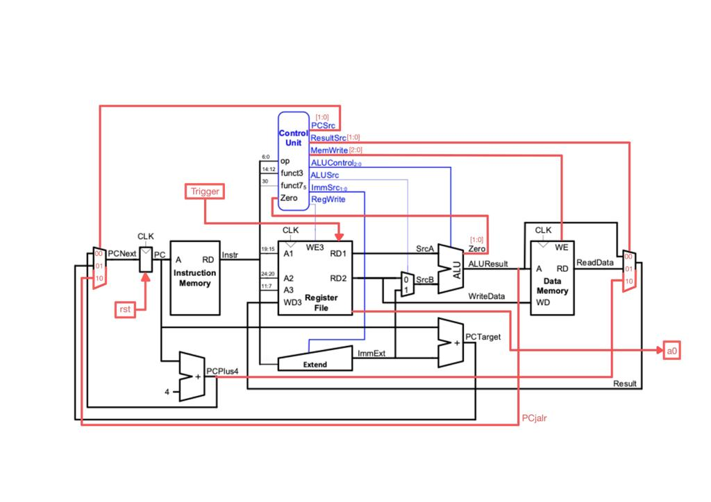
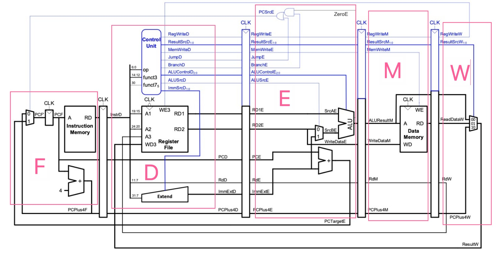
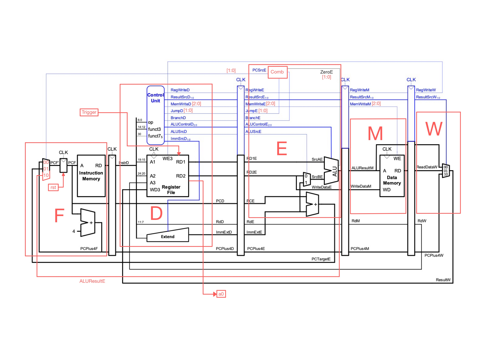
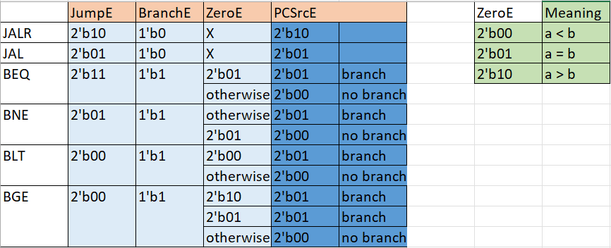
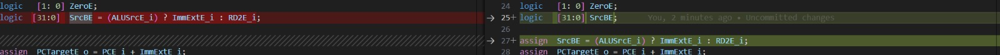

# Yi Keat Khoo's Personal Statement

### CID: 02021759, GitHub username: adrianyk

---
# Contents

- [Introduction](#introduction)
- [Summary of Contributions](#summary-of-contributions)
- [VERSION 1 - Single Cycle](#version-1---single-cycle)
- [VERSION 2 - Pipelining with nops](#version-2---pipelining-with-nops)
- [VERSION 3 - Pipelining with Hazard Unit](#version-3---pipelining-with-hazard-unit)
- [VERSION 4 - Cache](#version-4---cache)
- [Repo Organisation](#repo-organisation)
- [Reflection](#reflection)
---
# Introduction

We split the project into 4 main phases, Single Cycle, Pipelining with nops, Pipelining with Hazard Unit, and Cache, corresponding to the 4 versions we have in the rtl folder. I have structured my personal statement and will describe my contributions in the same order.  

---

# VERSION 1 - Single Cycle

We began the project by extending what we already wrote from [Lab 4](https://github.com/Bennybenassius/Team15 "https://github.com/Bennybenassius/Team15") where I was responsible for the [Control_unit.sv](https://github.com/Bennybenassius/Team15/commit/b843befc3253905d2aaeeaf7217c51b225bf65e9 "https://github.com/Bennybenassius/Team15/commit/b843befc3253905d2aaeeaf7217c51b225bf65e9"), [Sign_extend.sv](https://github.com/Bennybenassius/Team15/commit/cf1e18f05db5fa4ffbdae1d551ab0ea547f9732d "https://github.com/Bennybenassius/Team15/commit/cf1e18f05db5fa4ffbdae1d551ab0ea547f9732d") and [Instr_mem.sv](https://github.com/Bennybenassius/Team15/commit/3176f690f899ed5a7d1a4c07e6061e2a3a6d7be1 "https://github.com/Bennybenassius/Team15/commit/3176f690f899ed5a7d1a4c07e6061e2a3a6d7be1") modules in Lab 4. 
> See [fc5bc6b](https://github.com/Bennybenassius/Team15/commit/fc5bc6bb0382cae02fd075dcdcbfbb9b85dc84a1#diff-a7c273af74b636bc1e1545174a066ffe5b14b909626fbc00e17ae29aeb443b73 "https://github.com/Bennybenassius/Team15/commit/fc5bc6bb0382cae02fd075dcdcbfbb9b85dc84a1#diff-a7c273af74b636bc1e1545174a066ffe5b14b909626fbc00e17ae29aeb443b73"), [79d77c2](https://github.com/Bennybenassius/Team15/commit/79d77c23130dd404876f46133a0d353af4d74de0 "https://github.com/Bennybenassius/Team15/commit/79d77c23130dd404876f46133a0d353af4d74de0"), [038afb6](https://github.com/Bennybenassius/Team15/commit/038afb6486ebfebff2e2eab1407b9e62f795b684 "https://github.com/Bennybenassius/Team15/commit/038afb6486ebfebff2e2eab1407b9e62f795b684") , [f62433f](https://github.com/Bennybenassius/Team15/commit/f62433f618b14c8939aa616a16f74c7f59c71857 "https://github.com/Bennybenassius/Team15/commit/f62433f618b14c8939aa616a16f74c7f59c71857"), [8522d41](https://github.com/Bennybenassius/Team15/commit/8522d41d9655b9d0b5814de8d43a29550d2db16a "https://github.com/Bennybenassius/Team15/commit/8522d41d9655b9d0b5814de8d43a29550d2db16a") from Lab 4 for evidence of testing each module and fixing syntax errors. Note: Lab 4 repo was not well organised so we decided to have a new repo for the project. 

These were also the main modules that I was in charge of for the single cycle CPU. My first contribution was adding case statements for the new instructions [BEQ, ADD, JALR and JAL](https://github.com/Bennybenassius/RV32I-Team15/commit/5b97820a8f13469466582b837e1888f6b9fb0228 "https://github.com/Bennybenassius/RV32I-Team15/commit/5b97820a8f13469466582b837e1888f6b9fb0228") to the control unit, while _Benny_ worked on AND, XOR, SLL.  I then modified the instruction memory module according to the memory map as well as made it [little endian addressing](https://github.com/Bennybenassius/RV32I-Team15/commit/0cc7bc5d0d91d22490bad1528236756eec65c583 "https://github.com/Bennybenassius/RV32I-Team15/commit/0cc7bc5d0d91d22490bad1528236756eec65c583") which I have tested and verified to be working. I also had to make sure that the hex codes in instruction_code.mem are in opposite order to make little endian addressing work. In addition to that, _Yueming_ and I also identified a problem with the store word instruction where the word stored into data memory was in the wrong order, similarly for the load word instruction. We fixed the issue by [configuring SW in data_mem.sv to little endian addressing](https://github.com/Bennybenassius/RV32I-Team15/commit/fc5116efc7a686ca285bb68a87b1987cd62b9692 "https://github.com/Bennybenassius/RV32I-Team15/commit/fc5116efc7a686ca285bb68a87b1987cd62b9692") as well as for [LW](https://github.com/Bennybenassius/RV32I-Team15/commit/4f4660e0af2b43a7b353c2ca4c73dfd36749d12b "https://github.com/Bennybenassius/RV32I-Team15/commit/4f4660e0af2b43a7b353c2ca4c73dfd36749d12b"). I've also changed the signal names in each module to match that of the new schematic for better readability (See [66f6d1a](https://github.com/Bennybenassius/RV32I-Team15/commit/66f6d1ae222f083c266be65a923e9bf368014fa9 "https://github.com/Bennybenassius/RV32I-Team15/commit/66f6d1ae222f083c266be65a923e9bf368014fa9"), [66945f1](https://github.com/Bennybenassius/RV32I-Team15/commit/66945f1d19087af5ae785a91fdcba367bf0eab0d "https://github.com/Bennybenassius/RV32I-Team15/commit/66945f1d19087af5ae785a91fdcba367bf0eab0d")). 

I had read and fully understood how the F1 assembly program written by _Benny_ works, and worked with him to [implement a trigger](https://github.com/Bennybenassius/RV32I-Team15/commit/dd6a23407aaa482821837e1b11120ab0159d350c "https://github.com/Bennybenassius/RV32I-Team15/commit/dd6a23407aaa482821837e1b11120ab0159d350c") so we can trigger the CPU to start the F1 program externally via Vbuddy. Together with _Deniz_, we verified that the CPU was executing each ALU instruction correctly by [writing an ALU test code](https://github.com/Bennybenassius/RV32I-Team15/commit/1da91fcae1a443fe283ff7d44183bc47954dbabd "https://github.com/Bennybenassius/RV32I-Team15/commit/1da91fcae1a443fe283ff7d44183bc47954dbabd"), while the _Benny_ and _Yueming_ tested the remaining instructions. 

> **Extra:** _Yueming_ and I decided to implement two new instructions BLT and BGE which will be useful in the future for writing C++ code and converting to machine code directly. _Yueming_ worked on implementing the two instructions while I helped him test and debug them. Main issues I found that were the reasons BLT and BGE weren't working: there was a [typo in testbench causing reset signal to always be high](https://github.com/Bennybenassius/RV32I-Team15/commit/9d2046d0606834cbad7ead9ff667be266ef9ca97 "https://github.com/Bennybenassius/RV32I-Team15/commit/9d2046d0606834cbad7ead9ff667be266ef9ca97") and [sign extend cases not added for BLT and BGE](https://github.com/Bennybenassius/RV32I-Team15/commit/cf264caadf4c6554722f94aa71c656c14240499c "https://github.com/Bennybenassius/RV32I-Team15/commit/cf264caadf4c6554722f94aa71c656c14240499c"), both of which I have fixed and BLT and BGE were testing to be working. 

Once each module was tested working and we fixed all syntax errors (except for the data memory related parts), we ran the CPU on the F1 program and the lights turned on correctly after pressing the trigger, and turned off after a while. I then [added separate sections in the testbench file for running F1 and the reference program](https://github.com/Bennybenassius/RV32I-Team15/commit/abff0085c67601cfb535445c9aa5a863308fadd6 "https://github.com/Bennybenassius/RV32I-Team15/commit/abff0085c67601cfb535445c9aa5a863308fadd6") while _Yueming_ worked on the data memory module and implementing load and store instructions. Once that was done and verified to be working, I began testing our CPU on the reference program after making some [configurations](https://github.com/Bennybenassius/RV32I-Team15/commit/7426dfad7523f6f5e1b9eef5402a78d176d06d92 "https://github.com/Bennybenassius/RV32I-Team15/commit/7426dfad7523f6f5e1b9eef5402a78d176d06d92") needed to run the reference program (top_tb.cpp, data.mem, data_mem.sv, and instruction_code.mem). The correct output plot was seen on Vbuddy for all 4 data sets provided with the reference program, so our single cycle CPU was verified to be working. Test results can be found [here](https://github.com/Bennybenassius/RV32I-Team15/tree/main/test/result "https://github.com/Bennybenassius/RV32I-Team15/tree/main/test/result"). 

### Important design decisions we have made: 
1. [Changing the PC MUX to a 3 input one](https://github.com/Bennybenassius/RV32I-Team15/commit/5319b50308b95f305f9eb1b6176d2d86f61604e9 "https://github.com/Bennybenassius/RV32I-Team15/commit/5319b50308b95f305f9eb1b6176d2d86f61604e9") as we need an extra input: the ALUResult value to tell the CPU where to jump to for the JALR instruction (as the JTA for JALR is calculated by adding a register operand with the sign extended imm). 
2. [PCSrc is now a 2 bit signal](https://github.com/Bennybenassius/RV32I-Team15/commit/432b00be7499113e2b44f0cc8aac0adcc425f824 "https://github.com/Bennybenassius/RV32I-Team15/commit/432b00be7499113e2b44f0cc8aac0adcc425f824") for the reason explained in (1)
3. Changing the result MUX to a 3 input one as we need to write the value of PC+4 back to register for jump instructions JALR and JAL (store return address in regfile)
4. ResultSrc is now a 2 bit signal for the reason explained in (3)
5. The Zero signal is now a 2 bit signal for distinguishing between the 4 branch instructions BEQ, BNE, BLT and BGE

Below shows the [schematic that I've created](https://github.com/Bennybenassius/RV32I-Team15/commit/c9e95763a8d968c805b17eb23504e75845fece1a "https://github.com/Bennybenassius/RV32I-Team15/commit/c9e95763a8d968c805b17eb23504e75845fece1a") after discussing with my team members and compiling all the changes and additions we made:  

### Important mistakes:
1. When debugging the ALU, me and _Deniz_ faced an issue where the CPU isn't executing the instruction on the last line in instruction_code.mem. Later we found that the instruction memory array wasn't reading the last instruction correctly. The solution was simple: [add an empty line after the last instruction in instruction_code.mem](https://github.com/Bennybenassius/RV32I-Team15/commit/445323e76c849a5c3c57a10dc0fc3cc10a7e3367 "https://github.com/Bennybenassius/RV32I-Team15/commit/445323e76c849a5c3c57a10dc0fc3cc10a7e3367"). It was such an easy fix yet it took us hours to figure it out. Will never forget to have an extra empty line again. 
2. Not creating a separate branch each for our separate changes and testing which caused a lot of merge conflicts. From then on we either created new branches for testing and adding new changes, or communicated with each other about which files each of us should be editing to avoid merge conflicts as much as possible.
3. We spent quite a long time trying to resolve some unknown errors i.e. "obj_dir directory not found", "top_tb.cpp file not found", even though the obj_dir folder and top_tb.cpp were clearly there and we were in the correct directory in the terminal, which led to error connecting to Vbuddy. We later found that by deleting and making a new copy of the vbuddy.cfg file and the doit.sh file, the error was resolved.

---
# VERSION 2 - Pipelining with nops

The main file I was responsible for writing is the [Pipeline_Regfile_FD.sv](https://github.com/Bennybenassius/RV32I-Team15/commit/396a5fd7db9a658d745f25c74befee2525bd4163 "https://github.com/Bennybenassius/RV32I-Team15/commit/396a5fd7db9a658d745f25c74befee2525bd4163").  Again, I've changed the signal names and added new signals according to the new pipelined CPU schematic (See [4f4660e](https://github.com/Bennybenassius/RV32I-Team15/commit/4f4660e0af2b43a7b353c2ca4c73dfd36749d12b "https://github.com/Bennybenassius/RV32I-Team15/commit/4f4660e0af2b43a7b353c2ca4c73dfd36749d12b"), [3e6630f](https://github.com/Bennybenassius/RV32I-Team15/commit/3e6630f7f956758db289b46af5041c69b0f307ac), [3f54a9f](https://github.com/Bennybenassius/RV32I-Team15/commit/3f54a9f101ddab3ef7a16dcdc044a94e67c98e92 "https://github.com/Bennybenassius/RV32I-Team15/commit/3f54a9f101ddab3ef7a16dcdc044a94e67c98e92")) and fixed some syntax errors (See [1d67134](https://github.com/Bennybenassius/RV32I-Team15/commit/1d6713487790f5adb7bacead464e6286a1902681 "https://github.com/Bennybenassius/RV32I-Team15/commit/1d6713487790f5adb7bacead464e6286a1902681"), [dadb707](https://github.com/Bennybenassius/RV32I-Team15/commit/dadb707da5bdd56c1499884ed98f1c25952eda25), [284d20f](https://github.com/Bennybenassius/RV32I-Team15/commit/284d20f710b63daa13e27ddb1f45fa3b80a03421)). 

I understood that the instructions which will give control and data hazards are branch, jump instructions and any other instruction that had data dependency. After reading through the new F1_pipeline.s assembly (written with nops to work with pipelined CPU without hazard unit), I noticed [missing nops for jump instructions which I've added](https://github.com/Bennybenassius/RV32I-Team15/commit/50681a0c2523ed39e0bcb1b73917d49b03f90a79 "https://github.com/Bennybenassius/RV32I-Team15/commit/50681a0c2523ed39e0bcb1b73917d49b03f90a79"). As such I checked through the nop version of the assembly file and added any missing nops accordingly. I've also worked with _Benny_ to [modify the top.sv file accordingly](https://github.com/Bennybenassius/RV32I-Team15/commit/6e244e60aca14b823a837c3cb1e690525e049320 "https://github.com/Bennybenassius/RV32I-Team15/commit/6e244e60aca14b823a837c3cb1e690525e049320").  

Once everything was done, I did a final test to make sure everything was working, using the assembly file F1_pipeline.s (nop version). After adding missing nop and fixed some typos, we managed to get the F1 program with nops working on our pipelined CPU (without hazard unit). After that I moved on to test our CPU on the reference program. For the same reasons as the F1_pipeline.s, I had to first [make a pipelined version of the reference assembly file by adding nops](https://github.com/Bennybenassius/RV32I-Team15/commit/a198fe51521d8db9eb4c83a92b76475dd85a971a#diff-87370a061655a1c875e9cd2ad0c47484c6cd88ff1b124c04ea93e0a08aa956e3 "https://github.com/Bennybenassius/RV32I-Team15/commit/a198fe51521d8db9eb4c83a92b76475dd85a971a#diff-87370a061655a1c875e9cd2ad0c47484c6cd88ff1b124c04ea93e0a08aa956e3") where needed, then run it on our CPU. The CPU gave correct outputs for all 4 data sets. Again, test results can be found [here](https://github.com/Bennybenassius/RV32I-Team15/tree/main/test/result "https://github.com/Bennybenassius/RV32I-Team15/tree/main/test/result").

> Note: our pipelined CPU does **NOT** have a hazard unit yet therefore it must run an assembly program that has nops  

### Important design decisions we have made: 
1. _Yueming_ suggested the idea of dividing up the pipelined CPU into 5 main blocks which are the F block, D block, E block, M block and the W block, and the 4 pipeline registers regfile_FD, regfile_DE, regfile_EM and regfile_MW, for easier top level design, shown in the diagram below made by _Yueming_:   
     
   - **How it works:** instead of the top level file connecting up all the individual components like ALU, program counter, control unit, pipeline registers etc, it will now just connect the 5 blocks (F, D, E, M, W) and 4 pipeline registers (regfile_FD, regfile_DE, regfile_EM, regfile_MW). The individual components will then only need to be inside their respective blocks, i.e. the D block only involves RegFile.sv, Sign_extend.sv and Control_unit.sv and nothing else.   
   - **Reasons we did this:** 
	   1. Hierarchical design of the pipelined CPU
	   2. So that when we add the hazard unit later on, we only need to change the middle level files (F, D, E, M, W, regfile_FD, regfile_DE, regfile_EM, regfile_MW) and no longer have to change the bottom level files (Instr_mem.sv, ProgramCounter.sv, RegFile.sv, ...)
	   3. Note: any "passing by" signals (signals shown in the schematic that pass through a block but are not used within the block) won't be included as an input and output signal in that block
2. Extending from the blocked schematic that _Yueming_ drew, [I added the changes we made when designing our pipelined CPU]():  
    
	1. Same changes (1)~(5) carried forward from version 1 
	2. _Benny_ and I have decided to redefine the ZeroE signal (previously called Zero), so that the [LSB encodes equality (LSB=1 if equal, 0 if not), and the MSB encodes greater than/less than (MSB=1 if >, 0 if <)](https://github.com/Bennybenassius/RV32I-Team15/commit/9f3de7aba4b43e6c1146895e57cda6f57365e1b2 "https://github.com/Bennybenassius/RV32I-Team15/commit/9f3de7aba4b43e6c1146895e57cda6f57365e1b2") for better readability
	3. _Benny_ and I have also decided to [change JumpD to a 2 bit signal](https://github.com/Bennybenassius/RV32I-Team15/commit/eeecb78410f4333d8dbf75e9f6fafd84c1e3ecd8) to distinguish between non-jump instructions, JAL and JALR
	4. Decided to use a MUX instead of the AND and OR gates for the implementation of PCSrcE, so will be using case statements casing on JumpE, BranchE and ZeroE to output the correct PCSrcE for jump, branch and non-jump non-branch instructions, which I've [added the change to E.sv](https://github.com/Bennybenassius/RV32I-Team15/commit/501b6628be92eefd15bbda953a5ff1711e54005b "https://github.com/Bennybenassius/RV32I-Team15/commit/501b6628be92eefd15bbda953a5ff1711e54005b")
	5. _Yueming_ and I have decided to [use JumpD to distinguish between the 4 branch instructions](https://github.com/Bennybenassius/RV32I-Team15/commit/daef61d99678b4ef73518e54b6ecec1907f84cf7 "https://github.com/Bennybenassius/RV32I-Team15/commit/daef61d99678b4ef73518e54b6ecec1907f84cf7") as described in this table of control signals:   
	     
	   It was the only way we could think of at that moment to distinguish between the 4 branch instructions in order to output the correct PCSrcE, even though it isn't readable

### Important mistakes:
1. In E.sv, some signals were declared and assigned in the same line which gave an error: 
    Never doing this again.
2. Our register file was configured to write on positive edge of the clock, which was the main reason why it wasn't working because the regfile would read and write at the same time, causing a RAW data hazard. For a pipelined CPU to work, the regfile must be clocked to write on the negative edge and read on the positive edge, so that data can be written to the regfile in the first half cycle and read from it in the second half cycle. A major confusion I had was that I assumed "first half cycle" as "positive edge" and "second half cycle" as "negative edge". 
---

# VERSION 3 - Pipelining with Hazard Unit

For Version 3, I worked on [implementing Stall and Flush in the new hazard unit](https://github.com/Bennybenassius/RV32I-Team15/commit/7fb46f7dae1d08b22ad08b5c6ffa6bdd188a9711 "https://github.com/Bennybenassius/RV32I-Team15/commit/7fb46f7dae1d08b22ad08b5c6ffa6bdd188a9711") (Hazard.sv) module along with _Benny_. We've also [added EN and CLR signals](https://github.com/Bennybenassius/RV32I-Team15/commit/d6f2a3d58655650e58c6d6e43a38b14a8610799d "https://github.com/Bennybenassius/RV32I-Team15/commit/d6f2a3d58655650e58c6d6e43a38b14a8610799d") to F.sv, Pipeline_Regfile_FD and Pipeline_Regfile_DE for Stalling and Flushing.  Again, some general housekeeping (See [504da8d](https://github.com/Bennybenassius/RV32I-Team15/commit/504da8dcde666017af34511dd03d18a5cef2e2ed "https://github.com/Bennybenassius/RV32I-Team15/commit/504da8dcde666017af34511dd03d18a5cef2e2ed")).

This time, I worked on [writing the top file](https://github.com/Bennybenassius/RV32I-Team15/commit/1ae81f321103fe8e6632a6c0937319942c2c8899 "https://github.com/Bennybenassius/RV32I-Team15/commit/1ae81f321103fe8e6632a6c0937319942c2c8899") to connect up the hazard unit with the rest of the pipelined CPU, and assisted in debugging and fixing syntax errors afterwards. We noticed an error in GTKwave where the CPU is stalling one cycle late, resulting in the ADD and ADDI instructions after the LBU in the build loop of pdf.s disappearing/lost, not executed at all. We later realised that because of how I implemented Flush and Stall in Pipeline_Regfile_FD: one if-else statement for Flush and one if-else statement for Stall without realising that the two else statements are the same, which could lead to the same thing executing twice. Not only that, because the if-else statment for Flush was after Stall, the Flush would overwrite Stall. So we fixed that by [combining them into an if-elseif-else statement](https://github.com/Bennybenassius/RV32I-Team15/commit/91b1d303d3b922a6c2bd78d93601d8c8c3a76d83 "https://github.com/Bennybenassius/RV32I-Team15/commit/91b1d303d3b922a6c2bd78d93601d8c8c3a76d83"). Even then it wasn't entire correct. After discussing with _Yueming_, I understood that Stall should have priority over Flush (which will be more important when implementing Cache as for Cache to work we need to stall everything except the M block), so [we've added the change to make Stall priority](https://github.com/Bennybenassius/RV32I-Team15/commit/0f524f5b62b40cc749f22718b01ab8e2dcad4900 "https://github.com/Bennybenassius/RV32I-Team15/commit/0f524f5b62b40cc749f22718b01ab8e2dcad4900"). 

Finally, once everything was done and the above issue was fixed, we ran the F1 program and reference program again, and got the correct outputs for all 4 data sets and F1 lights turning on and off correctly. See test results [here](https://github.com/Bennybenassius/RV32I-Team15/tree/main/test/result "https://github.com/Bennybenassius/RV32I-Team15/tree/main/test/result").  

### Important mistakes:
1. Writing two sets of if-else statements in an always_ff block, with the else statements of both sets being the same so there is a chance of the same thing being executed twice (in this case updating the signals of Pipeline_Regfile_FD twice if the else statement gets executed in both stall and flush cases), causing instructions to be lost and the CPU stalling incorrectly. Will watch out for situations like this in the future.
2. Didn't have Stall have higher priority than Flush. 

---

# VERSION 4 - Cache

_Yueming_ was mainly in charge of implementing cache. I helped with testing and debugging the CPU with Cache. [Fixed a minor error](https://github.com/Bennybenassius/RV32I-Team15/commit/a4a5f8b434b4b76b2dd18a6180817780db6b4165 "https://github.com/Bennybenassius/RV32I-Team15/commit/a4a5f8b434b4b76b2dd18a6180817780db6b4165") where the mem_array size in data_mem.sv was incorrectly declared. 

Ran a final test on the CPU with Cache on both F1 an reference programs and got the correct outputs for both. Result videos can be found [here](https://github.com/Bennybenassius/RV32I-Team15/tree/main/test/result "https://github.com/Bennybenassius/RV32I-Team15/tree/main/test/result").

---
  
# Repo Organisation

I started off the project by first creating the [initial structure of the repository](https://github.com/Bennybenassius/RV32I-Team15/commit/9b7f88629fa2155e0fcf9bef110e2772adad3f0b "https://github.com/Bennybenassius/RV32I-Team15/commit/9b7f88629fa2155e0fcf9bef110e2772adad3f0b") according to the project brief, migrated files over from Lab 4 as we will be building on top of what we had from there, and setting up a [`.gitignore`](https://github.com/Bennybenassius/RV32I-Team15/commit/28c0679c50c482b02083cf3a1cf06e227ee8cc38 "https://github.com/Bennybenassius/RV32I-Team15/commit/28c0679c50c482b02083cf3a1cf06e227ee8cc38") file to ignore the generated `.vcd` files and all files in the `obj_dir/` directory. Our Lab 4 repo was not well organised so we decided to have a new repo for the project. 

As for how to organise our files for the different versions of the CPU that we need to do, we decided to have [separate folders for each version](https://github.com/Bennybenassius/RV32I-Team15/commit/4bddd30b098600f87540ef1be80478ec53713951 "https://github.com/Bennybenassius/RV32I-Team15/commit/4bddd30b098600f87540ef1be80478ec53713951"), and each subsequent version folder will contain all the files from the previous version (i.e. when done with version 2 pipelining with nops, copy paste all files into a new folder version 3 hazard unit and start working on the hazard unit). 

For our test results, I tried copy pasting the test result videos into my local copy of the repo, and pushing it to GitHub. The files were quite large so it was slow to push. Although I managed to push it to our remote repo, we couldn't view it in GitHub as the file was too large. After some discussion, I decided to upload all our test result videos onto a OneDrive folder and share the link to the folder in our repo. So I've made a README file containing the link [here](https://github.com/Bennybenassius/RV32I-Team15/tree/main/test/result "https://github.com/Bennybenassius/RV32I-Team15/tree/main/test/result"). 

Once we're done with all 4 versions, we discussed about how to make testing our CPU a smoother process. We've come up with the idea to [reorganise the test folder](https://github.com/Bennybenassius/RV32I-Team15/commit/ce90bcd0036c13c3fd922ad9ca975f67f73651e4 "https://github.com/Bennybenassius/RV32I-Team15/commit/ce90bcd0036c13c3fd922ad9ca975f67f73651e4") to have two subfolders result and playground, where the playground folder will have two copies of each version folder of our CPU, one configured to run F1 and one for the reference program so that we don't have to keep reconfiguring data_mem.sv, top_tb.cpp, instruction_code.mem and data.mem every time when swicthing between running F1 and the reference program. Instructions on how to use the playground folder for testing can be found [here](https://github.com/Bennybenassius/RV32I-Team15/tree/main/test/playground "https://github.com/Bennybenassius/RV32I-Team15/tree/main/test/playground").

---

# Reflection

## Things I learned from this project

### Technical Skills
1. Git 
	- much more comfortable using git commands. More in-depth understanding on branches, git push and git pull from terminal, merging, rebasing, stashing, Co-authoring teammates, git log, and most importantly using the `--amend` flag and to edit commit both before and after push. 
2. Markdown
	- much more confident in using markdown to write README files.
3. System Verilog and Verilator
	- much more familiar and confident in writing `.sv` files and testing them. 
4. Debugging skills
	- am now way more familiar with a lot of the erros that verilator shows
	- learned to use VS code extension WaveTrace to debug
	- increases perseverance and grit when debugging
### Soft Skills
1. Improved team management
2. Better at deadlining and organisations (communicated clearly with team members about what tasks needs to be done and by when)
3. Better are producing readable work for others to work on
4. Teamworking

---

## Mistakes

1. Not writing the personal statement and any other documentation alongside building the CPU. Had a lot of write-up piled up at the end when everything was done and it was genuinely difficult to remember exactly everything I contributed in detail.
2. Not having enough meetings with every team member present to keep everyone up to date. When we did have meetings or meet up to work together, not everyone was able to make it. This led to some team members not being updated of changes discussed and made and therefore were confused and took time to catch up. 
3. Some commit messages didn't include enough detail and were too vague. Hard to tell and remember what happened when making that commit. Could've included comments or a simple keyword to mark a checkpoint like "tested xxx and worked" or "tested xxx didn't work" followed by a "found issue: xxx in xxx.sv, changed to xxx". 

---

## What went well
Most importantly: outlining tasks and aims and what each of us are responsible for clearly in bullet points so that every knows what they need to do and what is left to be done. This made it easy to keep track of progress as well thus easier to plan and meet deadlines. 

---

## If I had more time
I would definitely work on a way to debug the pipelined CPU easier by passing the instruction signal through all 5 stages in the pipeline, translate the instruction code from hex to ASCII, then display it on GTKwave so we can easily tell what the current instruction is in each stage of the pipeline.