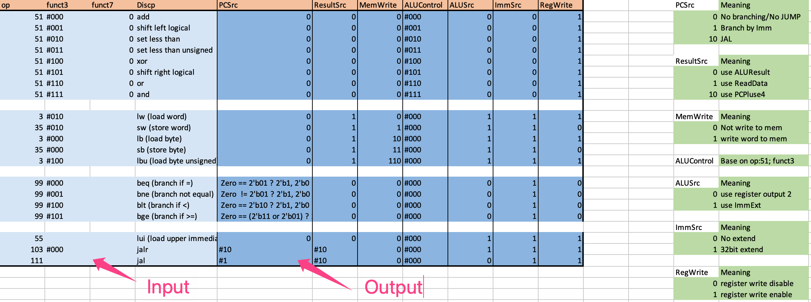
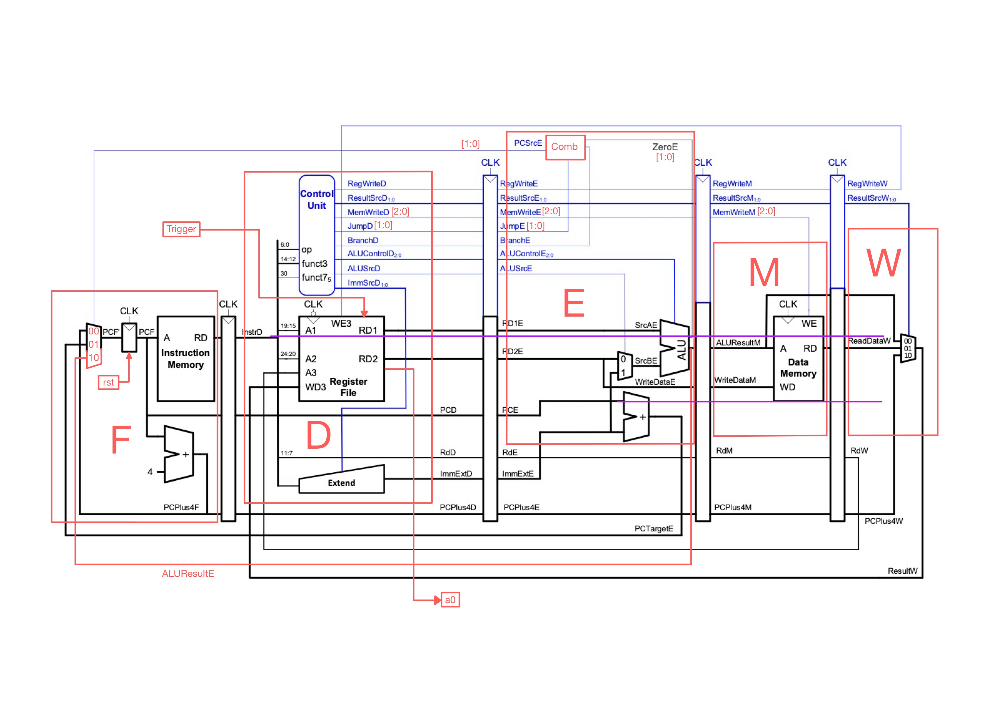
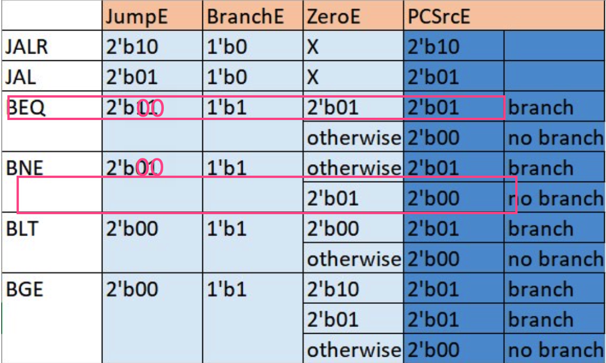
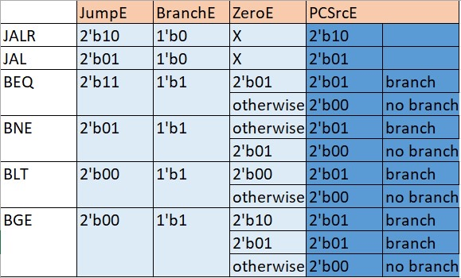
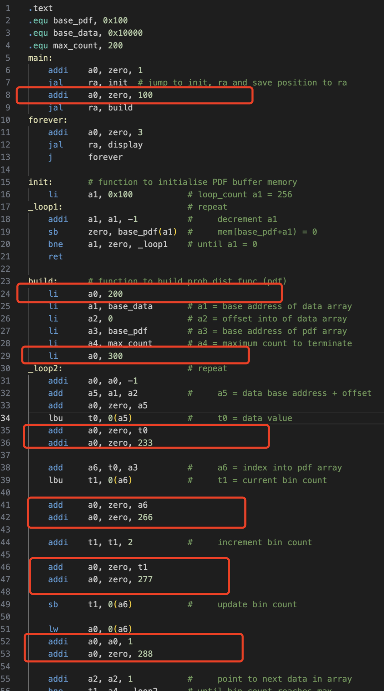
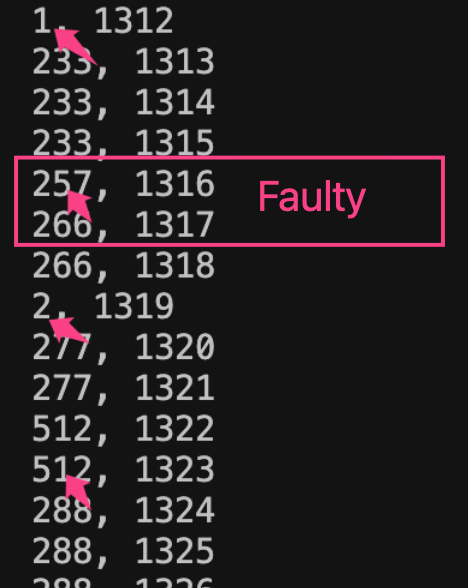

# Yueming Wang's Personal Statement
#### CID: 02061452, Github username: rrroooyyywang

---
REMARK: all commit links in this personal statment are not the finalized version. But is the first time of the corresponding commit.
### Inctroduction
In this section I would like to describe my statement structure.

During this project, our team work with each other closely and deliver jobs for each version evenly. So the focus of each person veries with versions. I fully participated and made contributions in every version. 

Therefore, in this personal statment, I will satate my work for each of 4 versions and also my little invention, test_toolkit, in five sections. In each section, I will go into describe what I have done and what special there are. 

After that I will reflect what I have learn, what I did well and what I can improve.

Last but not least, I will state what I would like to carry on to do that is inspired by this project.
### VERSION-1-SINGLECYCLEx

Our version 1 single cycle cpu is basicly migrate from Lab4. In Lab4, I was in charge of doing the top level design, testbench and debugging in Lab4 and I carry on to do this in our version 1 cpu. In additional to that, I design our whole memory module ([commit](https://github.com/Bennybenassius/RV32I-Team15/commit/fcdafe012e920198a7db647a6029b93534b1e0e7)) and add lb, lbu, sw and sb instruction to our cpu ([commit](https://github.com/Bennybenassius/RV32I-Team15/commit/2c42a6b6437dea211124f82572efc7eeca4b28db) and [commit](https://github.com/Bennybenassius/RV32I-Team15/commit/928766b461871dd04d06114918e0d6aa370f263e)) (lw is done in lab 4). Furthermore, a special design on adding two more branch instruction(BLT and BGE) were implemented ([commit](https://github.com/Bennybenassius/RV32I-Team15/commit/4a73eff8d09d251c12b59fb19b9463b6521389cf)). This work is cooperate with **Adrian** (I code, he test).

I also made two more non technical contribution to our group design. I suggested that our group can use do there job in seperate branch. So that people will not affect each other's work. Additional to that, I also come up with the idea of the control table (described in next part). 

#### _Special Design
**We implement BLT and BGE in our single cycle cpu**

The idea of adding this two instructions is coming from when I try to convert C/C++ language to RISC-V 32I assembly code. The for loop and while loop usually use less than as condition to continue the loop. 

For example:
```
for (int i = 0; i < 10; ++i){
    ...
}
```
```
int i = 0;
while (i < 10){
    ...
    ++i
}
```
And our current compiler like **clang** and **gcc** will convert these loop in to assembly code using BLT instruction. Therefore, I point it out to **Adrian**. And then me and **Adrian** decide to add BLT and its complement BGE to our cpu.

The implementation is just similar to other branch instruction. But with 4 branch instruction, we make 
`Zero` signal to 2 bit.

This result in some problem in version 2 pipelined cpu. I will discuss it later.

**The second special design: the 'Control table'.**
As we add more and more insturction in our cpu, the conrtol table provide us more clear view of what control unit dose so that it also reduce our risk or making mistakes in writing `Control_unit.sv`.


- The light blue part are input signals and its description. 
- The deep blue part are output siganls for signle cycle cpu. 
- The green section provide the meaning of output signals.

#### _Chellenge & mistakes

During the version 1, we had found difficuality in merging different branches using git, as we are not familia with git. But as we spend more time on using git, we gain more understanding of git and we are all 'git masters'.

Not many mistakes token in this version cpu.


### VERSION-2-PIPELINING

During the job disctrbution section of our version 2 cpu, I come up with the idea that seperate our cpu in to F, D, E, M, W and the corespondent pipeline registers,  DE, EM, FD and MW. This decision allow us to see the cpu in different pipeline stages. And it also facilitate our debug stage. 

Noticed that, in the version 2, we nolonger have `ALU_RegFile.sv`, but instead, we seperate it into `D.sv`, `Pipeline_Regfile_DE.sv` and `E.sv` blocks.

My job in version is to do the `D.sv` block and `W.sv` block ([commit](https://github.com/Bennybenassius/RV32I-Team15/commit/60884f0c821eb01dee52d6e993d639d7755c4c80) and [commit](https://github.com/Bennybenassius/RV32I-Team15/commit/0e8f98d1f33aa8df6e3c18b88d0f4e507e2ce65c)). And I also help with the design for the branch condition in `E.sv` block ([commit](https://github.com/Bennybenassius/RV32I-Team15/commit/501b6628be92eefd15bbda953a5ff1711e54005b)). And finnally I test and make it compile for debugging ([commit](https://github.com/Bennybenassius/RV32I-Team15/commit/9f436a8b758165c679d7f1865be627a54a97bd7b)).

During a discuess with **Benny** and **Adrian**, I point out the hazard coming from `JAL` and `JALR` instruction. This help **Benny** add more `NOP` instruction to `F1.s` and save time for the testing.


#### _Special Design
**We desicde to use JumpE to distinguish BEQ and BLT for PCSrcE**
In version 2 and later versions, the instruction will not be pass to next pipeline stage. In order to decide a branch in `E` stage only the `JumpD` and and `BranchD` will be pass into the stage. However, if we only use 1 bit for each signal, we could not distinguish 2 jump instruction and 4 branch instruction. So we decided to add one more bit to the `Jump` signal. 

However, for 2 bit branch, this enough to distinguish 2 jump instruction. But the 4 branch instruction are still not be distinguished.

Just like the case in following picture.


Therefore, we decided to also use `Jump` siganl to distinguish these `BEQ` and `BNE` base on the priciple of minimalism.


And these tables are made during our discuession. If we do not do it in control table. We hardly find this problem straight away. Therefore, you can see that, control table is very useful in design process. 

### VERSION-3-HAZARDDETECTION

In version 3, I only participate in debugging process. I point out a bug that is coming from lw/lb/lbu followed by add/addi that use same register. The debug process for this super long runtime program is not easy. And I come up with a new way to debug the code: adding 'Flag' in assembly code and display the 'Flag' status in runtime (add code to `top_tb.cpp`).

#### _Special Design
**Debug using 'Flag'**
This special design is not for the cpu, but for our debug process.

As I describe earlier, the reference assembly code `pdf.s` has reletively long runtime than other code we test with. As it will read out a very large data file. Therefore, we can not use gtkwave to see what happen during the runtime.

My method to solve this difficualty is to use `a0` register as a 'flag' and use `top_tb.cpp` to monitor the runtime.

Here is how I do it.

For different values of `a0` in , `100`, `200` and `300` indicate the what section of assembly code is being executed. 
- For example, if `a0` goes to `300`, that means the current runtime is at `_loop2`. 

And for the values of `a0` in, `233`, `266`, `277` and `288`, will indicate the meaning of value of `a0` in previous line. 
- For example if `a0` is `266`, that means last line shows the `t1` (current bin count).
- if `a0` is `277`, that means last line shows the `t1` (incremented bin count).



The exact faulty is displayed at the previous line of `a0` equal `266`. The current bin count should be 0, instead of 257. 

his is how it help me to find the bug.

### VERSION-4-CACHE
In version 4, I fully design, code and debug the whole section ([commit](https://github.com/Bennybenassius/RV32I-Team15/commit/758382f9560df747e60c18e7f4576cc249947d8e)). And my groupmates help me to test it on F1 and reference assembly program.


The cache I implement is a write-through direct map cache. With 8 sets and byte addressable.

#### _Special Designs

**The special designe I made for our `cache.sv` module is that we can output our cache memory wihtin on clock cycle theoretically. Here is how it works.**

`cache.sv` module will always check if there is cache hit or there is cache miss when the instruction is using M block(to see if the instruction is using M block, we check `ResultSrcM_o`). The cache will do data correction when cache miss or data replacement when cache hit in one cycle. When cache hit, the data will be able to output within that clock cycle at falling edge. If cache missed, the main memory will noticed by the signa cache_hit and the main memory will pass correct data to cache at falling edge, and therefore, the correct cache output will be ready to next stage at next rising edge. With my design, even we meet cache missed, the data will still going to be ready at next cycle theoretically. But in actual case the main memory will always need more cycle to read out the data depend on what technology it use. I will discuess it later.

**The second special design is to accelerate reference program. It is done by my cache replacement police.**

Cache replacement police designed to accelearte reference program pdf.s is done by if cache hit, the next set will be load by data from next address in main data memory. So that for all sequencial load, our next set is always ready to be hit. And 

**Here are some special designe for our cache memory, so that if the modules are made by difference technology like SRAM and RAM, our clock cycle can base on SRAM.**

I add a self check policy in `Data_mem.sv`, which output a mem_ready signal. When the cpu is doing a store instruction, the self chack part will always compare the current data stored in main memory with the input data that need to be write into main memory. If they are not the same (not fully store yet), the self check will always turn mem_ready low, which indecade that memory need more time to finish the load. The the self check also add to load instruction and it will allows the main memory to address and output data if it need more clock cycle.

And a `Stall.sv` block is add to top level. Which will stall every individual pipelining register when mem_ready or cache_hit is low.

With these freatures, the main memory and cache will be able to do its own job in multiple clock cycle. So that the main memory speed will not affect our cpu clock frequency. which means we allows our clock run much faster.

#### _Challenge & Mistakes
The biggiest chellenge I met, is the microarchitecture design. The recomend testbook did not point it out clearly. And base on my research, cache design is very flexible. Therefore, I decide to come up with my own design, instead of base on others.

The main mistake I made in this section are just some typos problems. And I sort it out very quickly.

And while dong this section, I found out a mistake that is coming from version 3. The stall operation should always has higher priority than flush. This mistake will not affect verison-3's output as they are mutually exclusive. But in version 4 will be problematic. And I sort it out at coding stage.
### test_toolkit
During designing our test for version 1 cpu, I come up with the idea of accelerating our test process by writing a python script. As in order to do test on our cpu, we need to write and modified our assembly code frequently. And then we have to go to online compiler, copy and paste the machine code to .mem file and finally do spacing for .mem data. and it can be done easily by a program.

#### _Special Design
**The goal I aimed to achieve is to test our cpu like we do programming on our own computer. That is, we write our assembly code and 'compile' it, after that we can see the result on our vbuddy.**

To achieve it, I build up the test_toolkit folder as is a templete testing environment. It include a `./src` folder copied from `Project_Brief./src`, a assembly file for the code you want to test, initially named by `test.s`, and finnaly `testit.py` file, which do all the magic.

What `testit.py` dose is perity straigh forward. 
- Firstly, the `testit.py` will know which version and which assembly code you what to do the test. 
- And secondly, it will copy and paste the source assembly code to `./src/myprog`. 
- After that,  `testit.py` will output a command in terminal that make hex code in `./src/myprog` by runing `Makefile` in `./src` folder.
- And then, the `testit.py` will copy the `.hex` file to the `Instr_mem.sv` and do the formatting. The specific `Instr_mem.sv` is sorted out in first stage.
- Finnally, the program will do the specific `doit.sh`. It is also sorted out in first stage.

### Reflection
This project is a challenging but rewarding experience. It has significantly contributed to my growth as a student and aspiring engineer. 

#### What I Learned:

**System Verilog Proficiency:**
At the begining of the project, our code hardly compile at first time. The code used to comes with many syntax errors and typos. As the project proceed, we are able to write system verilog with more care, and made less mistakes in syntax errors and typos. Beyon the syntax and typos, this project also deepen my understanding of writing hardware instead of coding programs.

**Risc-v 32I Architecture**
Through out this project. I gained valuable insights into instruction set architectures, pipeline stages and cache memory based on riscv. 
Building the cpu from scratch providing me more than learning it from lecture. During the coding and debugging process, I gain more sense of how the riscv instruction set were come up with. Maybe some of my thinking process also happened in the people who participate the designe the risc-v.

#### What I did well:

**Documentation**
During the project, I made documentation of what problem I met and what solution I try. It is realy helpful for me to write the personal statement. And also track the change I made can avoide lead myself in to a loop.

**Build tools**
The `control table` and the `test_toolkit` are realy useful eventually. Build tools that meet your own need turns out save much more time than the time you spend to build it. I will keep this habit for all the time.

#### What I can improve:
**more visualising**
If we add more visualization to dircription of the project. we can help the reader to understand our design more quickly. And with visualization, we can also speed up our debug process.

### Future work
During the debug processes. We would like to see if there are any routing issues. Having a visualized schematic will faclitate us very much. This imspired me to have a visualization for a set of system verilog files.

But base on my research, some of the tools are not opensource. And some of the opensource project with visualizing freature did not do a great job, like **yosys**. I also looked into **ISSIE**, done by our department. Which allow us to specificied modules by using verilog and wire the module manually. But this appilication not provide us feature convert a set of system verilog files and convert it into a schematic.

Therefore, convert a set of system verilog files into schematics(visualization) and make it illustrate the data flow, will be my future work. And want to apply for **UROP** in 2024, and aim to do this during summer 2024.

Beyon that, I also want the visualization tool can allow user do formatting by themselves. I will plan todo it as well.