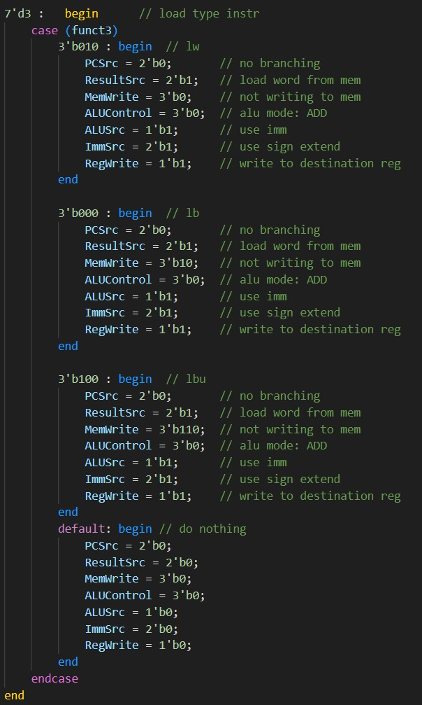
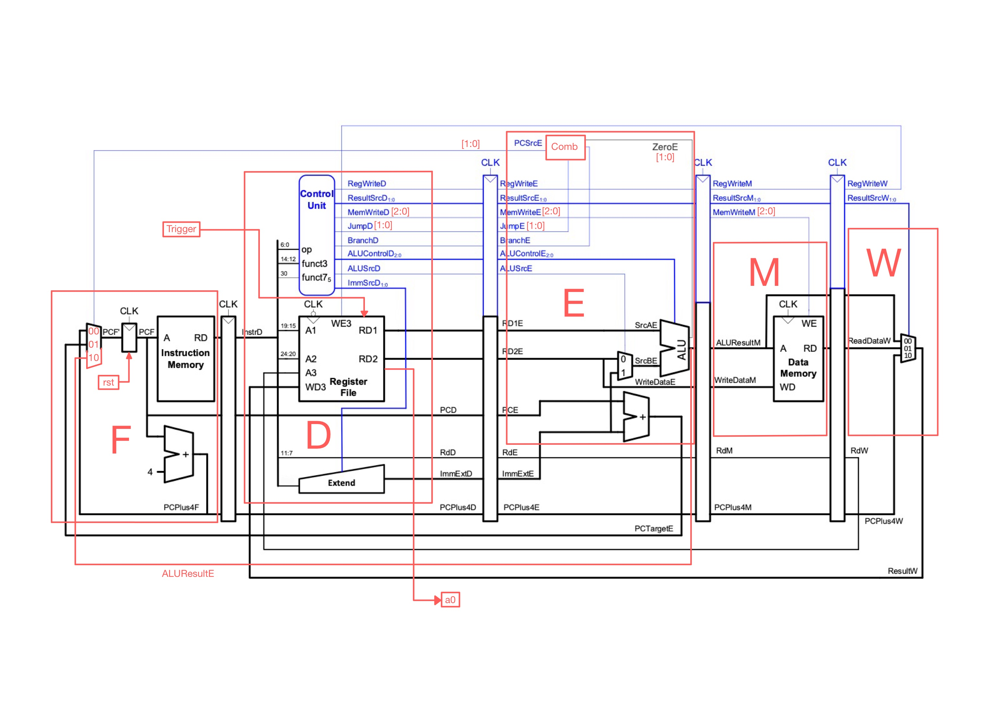
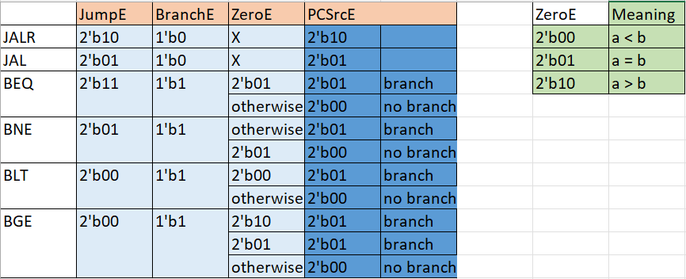
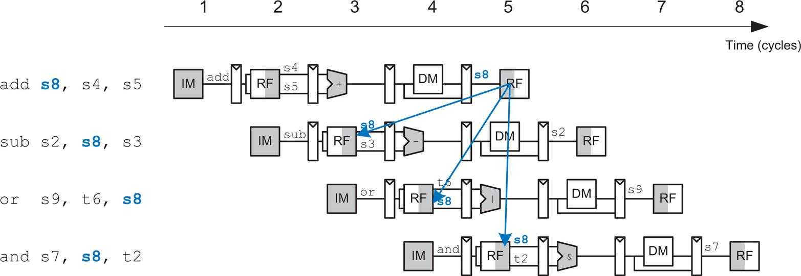
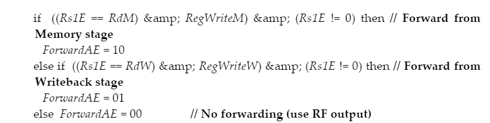
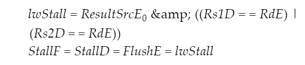
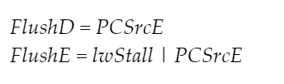

# RV32I-Team15

#### Contents:
1. [Overview](#overview)
	1. [Team Details](#team-details)
	2. [Repo Organisation](#repo-organisation)
2. [How our CPU works](#how-our-cpu-works)
	1. [Version 1: Single cycle CPU](#version-1-single-cycle-cpu)
	2. [Version 2: Pipelined CPU](#version-2-pipelined-cpu)
	3. [Version 3: Hazard Detection](#version-3-hazard-detection)
	4. [Version 4: Cache](#version-4-cache)
3. [How to test our CPU](#how-to-test-our-cpu)

---
# Overview

## Team Details

| Name           | CID      | GitHub   | Email                     | Link to Personal Statement|

|----------------|----------|----------|---------------------------|--------------|

| Yi Keat Khoo   | 02021759 | **adrianyk**  | akk121@ic.ac.uk  | [Yi Keat's Statement](Personal_Statements/Yi_Keat_Khoo.md)

| Benny Zong Liu | 02015180 | **Bennybenassius** | bencom2014@live.com     | [Benny's Statement](Personal_Statements/Benny_Zong_Liu/Benny_Zong_Liu.md)

| Deniz Goy      | 02221574 | **DenizzG** | denizgoy2003@gmail.com | [Deniz's Statement](Personal_Statements/Deniz_Goy.md)

| Yueming Wang  | 02061452 | **rrroooyyywang** (commited as root for few time) | yueming.wang22@imperial.ac.uk | [Yueming's Statement](Personal_Statements/Yueming_Wang.md)

  

## Repo Organisation

> Note: Migrated all base files from Lab4 repository at the start of the project. Please refer to Lab4 repository for complete commit history ([Link to Lab4 repo](https://github.com/Bennybenassius/Team15)).

The repo is organised into 4 main folders:
1.  [Personal Statements](#personal-statements)
2.  [rtl](#rtl)
3.  [test](#test)
4.  [test_toolkit](#test_toolkit)

#### Personal Statements
This folder contains all the personal statements of all 4 group members.

#### rtl
This folder contains all the CPU module files, test bench files and shell files for verilating, compiling and running the project files. This folder contains 4 main subfolders, each containing a version of our CPU with more features.

The final CPU with Cache is under the folder VERSION-4-CACHE and it contains our CPU design that is capable of pipelining, hazard detection and caching.

#### test
This folder contains copies of the files in rtl, solely for testing purposes so that all testing can be done in a separate environment without touching the original copy of our source code. The playground folder in here is where you will do testing. It contains all the hex files to load into the instruction memory file, as well as the assembly code (.s) files that is used to generate it.

The inner rtl folder in playground also contains 2 different copies for each version of our CPU, one configured to run the F1.s program and the other for the reference pdf.s program provided.

#### test_toolkit

This folder contains the assembler and the python files necessary to make the hex-code files into little-endian formatted. The folder contains a readme as well that contains the instructions on how to use it.
  
  

# How our CPU works

We have decided to split the development of our CPU into 4 distinct stages that reflect the features that we have added to our CPU. The stages are:

1. [Version 1: Single cycle CPU](#version-1-single-cycle-cpu)
2. [Version 2: Pipelined CPU](#version-2-pipelined-cpu)
3. [Version 3: Hazard Detection](#version-3-hazard-detection)
4. [Version 4: Cache](#version-4-cache)

## Version 1: Single cycle CPU

The single cycle CPU expanded upon our existing CPU from Lab4, adding additional instructions and modules to support data memory to first run F1.s, and then the provided pdf calculating program pdf.s.

#### Making the CPU capable of running F1.s

The F1.s program is created to simulate the behaviour of the F1 lights where the lights on Vbuddy will turn on sequentially in approximately 1 second intervals until all lights have been lit up. After which all the lights will turn off after a random delay.

Our team broke down the requirements of the F1.s program as follows:
1. F1 lights can be represented as a Finite State Machine (FSM)
    - The state of the machine need to be stored in a specific register (a0)
2. We need a subroutine to count down from an arbitrary number that would take the CPU around 1 second to count down
    - JAL and JALR are used here
3. Shift and bitwise operators are needed to implement LFSR needed for a pseudo-random countdown
    - Bitwise operators like XOR and AND are needed
4. Branching is needed to provide appropriate flow control for triggering the F1 machine
    - BNE and BEQ are needed
5. External trigger is needed to trigger the F1.s FSM

Now that the requirements have been broken down, we began implementing the needed instructions.

JAL and JALR instructions require a new input source for the Program Counter, thus needing a 3 input MUX. As such we increased the bit-width of the PCSrcE signal to 2 bits so that it can MUX the correct PC next value into the Program Counter. Additional lines also needed to be piped in from the ALUResult output so that we have the JTA for JALR instructions.

After all instructions needed have been implemented, the resulting F1.s program was able to be run on the CPU, which could be externally triggered by pressing the rotary encoder. The output which was stored in the register a0 was passed directly into the LEDs on the Vbuddy through the test bench's  vbdBar() function.

The trigger was implemented by directly wiring the value of vbdFlag() into the register t0 (x6), which the program constantly checks if it is equal to 1. If it is this would then start the rest of the program and the lights start to light up.

[Link to video showing F1.s working on Vbuddy](https://imperiallondon-my.sharepoint.com/:v:/g/personal/akk121_ic_ac_uk/EeAnmGvkUVxCtfUxaINEJLEBKaCNc45LPiW3A5sDkg0fKQ?nav=eyJyZWZlcnJhbEluZm8iOnsicmVmZXJyYWxBcHAiOiJTdHJlYW1XZWJBcHAiLCJyZWZlcnJhbFZpZXciOiJTaGFyZURpYWxvZy1MaW5rIiwicmVmZXJyYWxBcHBQbGF0Zm9ybSI6IldlYiIsInJlZmVycmFsTW9kZSI6InZpZXcifX0%3D&e=Jyswkr "https://imperiallondon-my.sharepoint.com/:v:/g/personal/akk121_ic_ac_uk/EeAnmGvkUVxCtfUxaINEJLEBKaCNc45LPiW3A5sDkg0fKQ?nav=eyJyZWZlcnJhbEluZm8iOnsicmVmZXJyYWxBcHAiOiJTdHJlYW1XZWJBcHAiLCJyZWZlcnJhbFZpZXciOiJTaGFyZURpYWxvZy1MaW5rIiwicmVmZXJyYWxBcHBQbGF0Zm9ybSI6IldlYiIsInJlZmVycmFsTW9kZSI6InZpZXcifX0%3D&e=Jyswkr")
#### Expanding on the CPU to run pdf.s

pdf.s is a program that generates a Probability distribution function (PDF) by counting the number of times a value appears from a pool of 8 bit chunks of data read from data memory and storing the result in a 256-bit long section of memory before plotting it out. This program requires RAM that can be read from and written from at will, which will be controlled by the ALU determining which address to read from, and the Control unit telling the memory to read or write the data it is being fed with.

Additionally, LBU, LB, SB and SW instructions were needed to read and write to the data memory. These were implemented as case statements in the `Control_unit.sv`.

[Link to video showing pdf.s working (Vbuddy plotting gaussian.mem)](https://imperiallondon-my.sharepoint.com/:v:/g/personal/akk121_ic_ac_uk/EayxIZHW3VZCvGzLnLgF-HABQM9Uqh-eqOc6uxd8LUei7A?nav=eyJyZWZlcnJhbEluZm8iOnsicmVmZXJyYWxBcHAiOiJTdHJlYW1XZWJBcHAiLCJyZWZlcnJhbFZpZXciOiJTaGFyZURpYWxvZy1MaW5rIiwicmVmZXJyYWxBcHBQbGF0Zm9ybSI6IldlYiIsInJlZmVycmFsTW9kZSI6InZpZXcifX0%3D&e=kr7DQT "https://imperiallondon-my.sharepoint.com/:v:/g/personal/akk121_ic_ac_uk/EayxIZHW3VZCvGzLnLgF-HABQM9Uqh-eqOc6uxd8LUei7A?nav=eyJyZWZlcnJhbEluZm8iOnsicmVmZXJyYWxBcHAiOiJTdHJlYW1XZWJBcHAiLCJyZWZlcnJhbFZpZXciOiJTaGFyZURpYWxvZy1MaW5rIiwicmVmZXJyYWxBcHBQbGF0Zm9ybSI6IldlYiIsInJlZmVycmFsTW9kZSI6InZpZXcifX0%3D&e=kr7DQT")

>Note: complete test result evidence can be found [here](https://imperiallondon-my.sharepoint.com/:f:/g/personal/akk121_ic_ac_uk/Ehlvp3lFjjJOtuF8a04whYUBq_sv862ydrhfVrYSf5kVDw?e=MGceZS "https://imperiallondon-my.sharepoint.com/:f:/g/personal/akk121_ic_ac_uk/Ehlvp3lFjjJOtuF8a04whYUBq_sv862ydrhfVrYSf5kVDw?e=MGceZS").

## Version 2: Pipelined CPU

We began by first decomposing the pipelined CPU architecture into a hierarchical structure, shown below: 

> Note: the above schematic includes the changes we made to the original schematic (highlighted in red) which were essential in making our functioning pipelined CPU

#### Schematic Explained:
The top level module will be made of the 5 blocks F, D, E, M, W and 4 pipeline registers FD, DE, EM, MW, rather than wiring up every individual component (ALU, control unit, sign extend, etc) to make `top.sv`. Instead, each individual component will reside within their respective blocks for example ALU, control unit and sign extend will be connected within `D.sv` along with other i/o signals, similarly for the other blocks. This way, when we move on to implement hazard unit, we only need to modify the block `.sv` files and the pipeline register `.sv` files, instead of having to modify each individual component. 
#### Running F1 on our Pipelined CPU
Since we are only implementing a basic pipelining design (without hazard unit), it was necessary to add nops to our F1.s assembly program in order to make it work. We identified all instructions in F1.s that would cause a data or control hazard and added nops accordingly, updated in the new [F1_pipeline.s file](test/playground/F1_pipeline.s) (hazards will be further explained in detail in the [next section](#version-3-hazard-detection)). Instructions that needed nops to function correctly are branch and jump instructions, and any other instructions that had data dependency. 

Other changes that we made include:
1. 3-input PC MUX and changing `PCSrcE` to a 2 bit signal, for reasons explained in the [previous section](#making-the-cpu-capable-of-running-f1.s)
2. Changing `JumpD` to a 2 bit signal to encode jump, branch, and non-jump non-branch instructions, as shown in the table below:
   
3. Changing `ZeroE` to a 2 bit signal to encode equality using the LSB (LSB=1 if equal, else 0) and greater than/less than using the MSB (MSB=1 if >, else 0), shown in the table above. Used for distinguishing BEQ, BNE, BLT and BGE
4. Changing `MemWriteD` to a 3 bit signal to distinguish between the different load and store type instructions within the data memory module
5. Using case statements to implement the correct output value for `PCSrcE`, casing on `JumpE`, `BranchE` and `ZeroE`, as it was a more direct approach

Once those changes are updated across all our module files, we connected up the 5 blocks and 4 pipeline registers in `top.sv` and began debugging and testing. A crucial mistake we discovered was that our register file (`RegFile.sv`) was configured to write data into the register file on the positive clock edge when it should've been writing on the negative edge. Writing on the positive edge meant that our CPU register file was reading and writing at the same time which was the main reason it wasn't working. 

After fixing the mistake above and some other syntax errors, our pipelined CPU succesfully ran the F1 program (pipeline version). 

> Note: since this version of the CPU does **NOT** have hazard unit yet, it must run assembly programs with nops 

#### Running Reference Program on our Pipelined CPU
For reasons explained above, first we had to add nops to the pdf assembly code before running it on our pipelined CPU without hazard unit. The test went smoothly as the CPU gave correct outputs for all 4 data sets. 

## Version 3: Hazard Detection

To implement the Hazard detection module, we often referred to the textbook "Digital Design and Computer Architecture: RISC-V Edition" by Harris, Sarah L. This textbook goes in-depth on how to implement hazard detection, and it greatly helped our understanding of an optimal implementation.

Implementing Pipelining leaves our CPU fragile against Hazards. When an instruction is dependent on the result of the previous instruction, a hazard could occur causing an incorrect value to be calculated by the next instruction. The two different types of Hazards are called:
1. Data Hazard
2. Control Hazard

Below is an example of a data hazard. The value of register s8 is used in the second instruction, sub, but it has not been written back to the register yet, therefore the value of s8 used in sub, and the following or instruction will be incorrect.

A Data Hazard occurs when an instruction tries to read a value that has not yet been written back from the previous instruction. A Control Hazard occurs when the instruction being fetched is wrong, as a previous instruction changed the next instruction to fetch but this has not been written back before the fetch occurs.

The Hazard Detection module implements multiple techniques which tackle each individual problems. The techniques are:
1. Forwarding 
2. Stall
3. Flush

#### Data Hazards (part 1)
Forwarding is necessary when an instruction being executed has a source register matching the destination register of an instruction in the Memory or Writeback stages. The logic for the forwarding stage of the CPU is given below from the textbook:

#### Data Hazards (part 2)
Stalls are implemented to stop the functions of the fetch and decode stages when a **Load type** instruction occurs. Stalls are used to stop data hazards from occurring. Stalling occurs when we disable a pipeline register. When a stage is stalled, all previous stages should also be stalled so that later instructions are not lost. Stalls are used carefully inside of our CPU as excessive stalls with make the CPU run a lot slower.

After a stage is stalled, the pipeline registers after the stalled stage must be flushed in order to make sure that incorrect information isn't written anywhere or used in later stages. Below is an image from the textbook showing the logic we used for controlling stalls:

#### Control Hazards
Finally, control hazards occur when we do not know which instruction to fetch next because the branch instruction has not yet finished executing, Therefore, we require flushing to parse instructions until the branching instruction has finished executing and determined the next value of PC. Below is an illustration of this error:

When a brunch is taken, the two instructions which are running after this brunch must be flushed from the Decode and Execute stages. We added a `CLR` input to the DE pipeline register. We added `FlushD` and `FlushE` outputs to the Hazard unit. When a branch is taken, `FlushD` and `FlushE` become 1, indicating that they need to flush the Decode and Execute stages. Below is the logic for this process:

When implementing Hazard detection, we each went about changing the relevant Pipeline blocks and also added the individual techniques. Below is how we split the work:

_Deniz_: Forwarding, D Block, E block
_Adrian_: Flush and Stall
_Benny_: Flush and Stall

While the three of us were working on the hazard unit, _Yueming_ worked on implementing cache data memory.

## Version 4: Cache

Comparing version 4 with version 3, the main changes in version 4 were:
- `cache.sv` and `Stall.sv` were added;
- `Data_mem.sv`, `Pipeline_Regfile_DE.sv`, `Pipeline_Regfile_EM.sv`, `Pipeline_Regfile_FD.sv`, `Pipeline_Regfile_MW.sv` and `top.sv` was modified;
- `M_cache.sv` replaced `M.sv`.

Our cache is a write-through, byte addressable cache memory, with 8 set memory, each set will store 4 bytes of data.

The general process of how cache will work is shown below.

- `cache.sv` will see if there is a cache hit or a cache miss when `M_cache.sv` is used.
- If there is a cache hit, we do not need to replace the current set data, but `cache.sv` will do the data replacement for next cache set which comes from the next address in main memory (`Data_mem.sv`). This is done at falling edge.
- If there is a cache miss, we will need to replace the current set data. `Data_mem.sv` will deliver current address data to `cache.sv`. `cache.sv` will write this data to current set and then `cache.sv` will output the data. These are done on the falling edge as well, but it may be done in a different clock cycle.

In order to have the benefit of using cache, we need our clock cycle to be based on cache instead of the main memory. This is done by letting main memory do its own thing in multiple clock cycles. A self-check function was added in `Data_mem.sv`, which outputs a mem_ready signal. When the CPU is doing a store instruction, the self-check function will always compare the current data stored in main memory with the input data that needs to be written into main memory. If they are not the same (not fully stored yet), the self-check will always turn mem_ready low, which indicates that the main memory needs more time to fetch data. The self-check function was also added to the load instruction which gives the main memory more time to fetch the correct data.

In order to give the memory stage more time to fetch data without affecting the pipeline structure, `Stall.sv` and `M_cache.sv` were added. `M_cache.sv` not only wired up `cache.sv` and `data_mem.sv`, but also outputs a `StallAll` signal which depends on the signals `cache_hit` and `mem_ready`. If any one of them is low, `StallAll` will be high. `Stall.sv` will receive the `StallAll` signal as well as the stall signals from the hazard unit (`StallF` and `StallD`), and it will decide whether to stall all or stall some of the pipelining registers or not stall any. 
  

# How to test our CPU

Please head over to the [playground](test/playground) folder for detailed instructions on how to test our CPU. 

> IMPORTANT NOTE: when testing version 2: pipelining, must use `F1_pipeline.s` (for F1) and `pdf_pipeline.s` (for reference program) as version 2 is pipelining without hazard unit hence nops are necessary

The F1 program will trigger upon pressing the rotary encoder, after which the LED lights will light up akin to how F1 lights light up in real life before turning off after a random delay. Press the rotary encoder again to trigger the F1 lights again.

The reference program on the other hand, will plot out the pdf of either a gaussian, noisy, sine or triangle distribution depending on which data set is loaded into `data.mem`. 